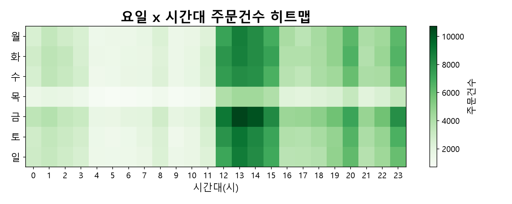
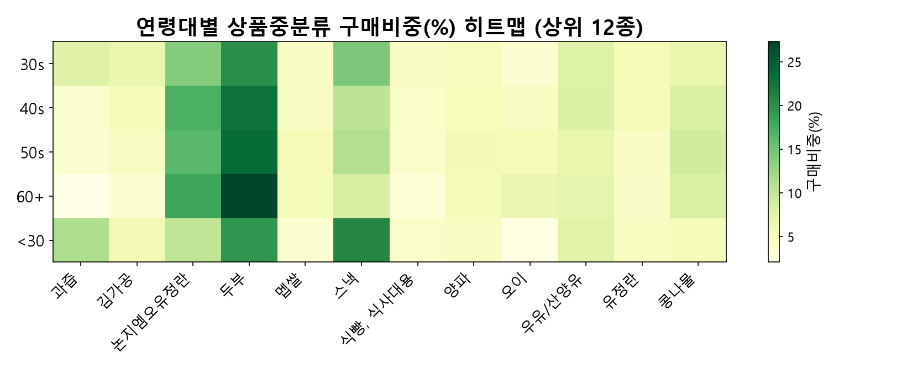
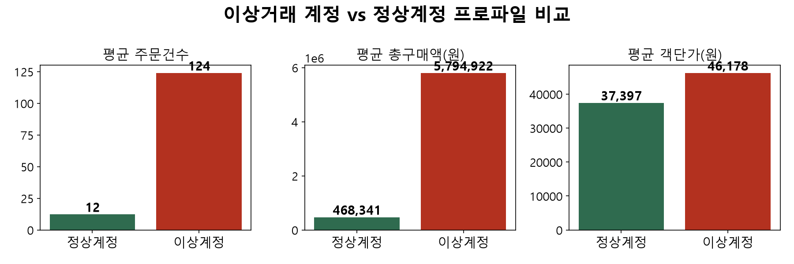

# 이커머스데이터 — Uplift 기반 프로모션 타겟팅 분석

제공받은 이커머스 기업의 데이터를 분석하고, **Uplift 모델링**으로 "프로모션을 줘야 실제로 반응하는 고객"을 골라내는 타겟팅 전략을 설계한 팀 프로젝트입니다.

## 배경 & 문제의식

"모든 고객에게 같은 프로모션을 뿌리는" 방식 대신 **개인별 Uplift(순증효과) 점수**로 타겟을 좁히는 전략을 제안합니다. 이미 어차피 구독·구매했을 고객(Sure Thing)에게 쓰는 예산은 낭비이므로, 프로모션이 있었을 때와 없었을 때의 차이가 실제로 큰 사람만 골라내는 것이 핵심입니다.

제공받은 이커머스 회사 데이터와 국내 온라인 시장을 조사해 보았을때 9월에서 10월 넘어갈 때의 하락은 업계 전체가 겪는 하락이었습니다. 이 시기를 위기가 아닌, 오히려 남들보다 먼저 체질을 개선할 기회로 포착했습니다.


## Uplift 모델링이란?

한 사람에게 "프로모션을 줬을 때(treated)"와 "안 줬을 때(not treated)" 각각 구매할지를 놓고 보면, 고객은 아래 4가지 유형으로 나뉩니다. 이 중 프로모션 예산을 써야 하는 사람은 **Persuadable**(초록) 뿐이고, 오히려 역효과가 나는 **Sleeping Dog**(빨강)은 반드시 제외해야 합니다.


| 유형 | 처치 시 구매 | 미처치 시 구매 | 대응 |
|---|---|---|---|
| Persuadable | YES | NO | 타겟 1순위 — 프로모션이 실제로 구매를 만들어냄 |
| Sure Thing | YES | YES | 프로모션 없어도 어차피 구매 — 예산 낭비 |
| Lost Cause | NO | NO | 프로모션을 줘도 안 삼 — 효과 없음 |
| Sleeping Dog | NO | YES | 프로모션이 오히려 구매를 막음 — 역효과, 절대 제외 |

실제 계산은 구독자 그룹과 비구독자 그룹을 각각 독립적으로 모델링(T-learner)해, 두 예측 확률의 차이를 Uplift 점수로 씁니다:

```
Uplift(고객 X) = P(구매 | X, 구독시켰다면) − P(구매 | X, 구독 안 시켰다면)
```

이 점수가 높은 사람일수록 Persuadable에 가깝다고 보고 우선 타겟팅합니다.

## 접근 방법

- **Treatment**: 멤버십(정기배송) 구독 여부
- **Y**: 기준일 이후 14일 내 재구매 여부
- **메타러너**: T-learner(구독자/비구독자 각각 독립 모델 학습 후 예측값 차이로 Uplift 계산)를 메인으로 채택하고, X-learner로 교차검증. S-learner는 Treatment 신호가 약할 때 Sure Thing만 찾아내는 함정(Sure Thing 함정)이 있어 채택하지 않음
- **대표 모델 2종**: 로지스틱회귀(L1 정규화, 해석 쉬운 선형 모델)와 RandomForest(비선형 상호작용을 잡는 앙상블 모델) — 두 모델이 동시에 지목한 고객만 신뢰하는 이중검증 방식으로 최종 타겟팅 리스트 산출
- **4대 가설(H1~H4)**: 가격 민감도(구매금액 구간), 지역×배송조건, 계절성 상품, 연령×성별 세그먼트별로 프로모션 반응 차이를 검증

자세한 방법론과 실측 수치는 [`docs/모델링_통합결과_H1_H4.md`](docs/모델링_통합결과_H1_H4.md), [`docs/리더보드_run10.md`](docs/리더보드_run10.md)를 참고하세요.

## 리포지토리 구조

```
docs/        프로젝트 정의서·EDA 인사이트·모델링 통합결과 등 핵심 문서
reports/     발표용 리포트/대시보드
notebooks/   제출용 Jupyter Notebook
src/         전처리·모델링 파이프라인 스크립트 (run01~run22)
data/        전처리 결과·모델 출력 CSV + 원본/병합 데이터(zip)
dashboard/   FastAPI + Streamlit 인터랙티브 대시보드
```

### `src/` — 파이프라인 실행 순서

1. `merge_and_enrich.py` — 원본 3테이블 병합 + 외부변수(계절·금리·소비자심리지수 등) 결합
2. `preprocess_pipeline.py` — 정제·파생변수(RFM, 가격구간, Y 정의 등)·Train/Holdout 시간 분할
3. `run01b_kitchen_sink_l1.py`, `run08b_uplift_forest_gridsearch.py` — 대표 T-learner 2종(로지스틱 L1 / RandomForest, GridSearchCV 튜닝)
4. `run22_xlearner.py` — X-learner 교차검증
5. `run06`~`run19` — 매출/이탈/RFM/코호트/연관규칙 등 보조 분석
6. `run09_backtesting_persuadable.py`, `run10_leaderboard.py`, `run11_final_targeting_list.py` — 팀 4인 결과 백테스팅 + 최종 타겟팅 리스트 산출

### `data/`

- `raw_and_merged_data.zip` — 원본 3테이블(`Sales_Data.csv` 등)과 병합본(`merged_master*.csv`)을 압축(원본 약 370MB → 약 48MB). 압축 해제 후 `raw/`, `processed/` 경로에 그대로 두면 위 스크립트들이 그대로 동작합니다.
- `snapshot_train.csv` / `snapshot_holdout.csv` — 실제 모델 학습·검증에 쓰인 스냅샷(시간 기준 분할)
- 그 외 `run*_scores*.csv` — 각 스크립트의 실행 결과(개인별 Uplift 점수, 백테스팅 상관, 최종 타겟팅 리스트 등)

### `dashboard/`

FastAPI 백엔드 + Streamlit 프론트엔드로 만든 인터랙티브 버전입니다. 실행하려면:

```bash
pip install -r dashboard/requirements.txt
python dashboard/backend/main.py        # http://localhost:8000
streamlit run dashboard/frontend/app.py # http://localhost:8501
```

가벼운 정적 버전은 `reports/대시보드_통합본.html`을 그냥 더블클릭해서 열면 됩니다(서버·인터넷 연결 불필요).

## 핵심 결과 요약

- 로지스틱·RandomForest 두 모델이 각각 독립적으로 계산했는데도 둘 다 Persuadable로 지목한 고객 수는 무작위로 겹쳤을 때 기대되는 수보다 훨씬 많았습니다(팀 4명의 모델을 모두 합친 만장일치 그룹은 무작위 기대치의 12~34배). 계산 방식을 T-learner에서 X-learner로 바꿔도 고객 순위가 크게 달라지지 않아(순위상관 0.80), 특정 방법론에서만 우연히 나온 결과가 아님을 확인했습니다.
- "재구매 확률" 기준으로 계산한 Uplift는 양수였지만, "매출액" 기준으로 계산하면 고가 상품 구매군에서는 오히려 음수가 나왔습니다 — 구독을 유도하면 재구매 횟수는 늘어도 건당 결제 금액은 줄어들 수 있다는 뜻입니다. 그래서 최종 타겟팅 리스트에는 "매출 리스크 등급(Tier)"을 함께 표시해, 재구매만 보고 타겟팅했을 때 매출이 줄어들 위험을 미리 걸러낼 수 있게 했습니다.

### 대표 모델 2종 진단

T-learner를 구성하는 두 모델 각각의 하이퍼파라미터 튜닝·회귀계수(또는 피처 중요도)·혼동행렬·ROC 곡선입니다. 둘 다 Holdout AUC 0.88 안팎으로 성능은 비슷하지만, 개인별 Uplift 순위는 거의 무상관(0.09)이라 두 모델이 동시에 지목한 고객만 신뢰하는 이중검증 방식을 씁니다.


### 그 외 EDA 시각자료

<table>
<tr>
<td><br><sub>요일×시간대 주문건수 — 평일 12~15시, 금요일에 집중</sub></td>
<td><br><sub>연령대별 상품중분류 구매비중 — 60대 이상은 두부·스낵 비중이 뚜렷하게 높음</sub></td>
</tr>
<tr>
<td colspan="2"><br><sub>이상거래 의심 계정은 평균 주문건수가 정상계정의 약 10배 — 전처리 단계에서 별도 플래그로 분리</sub></td>
</tr>
</table>
