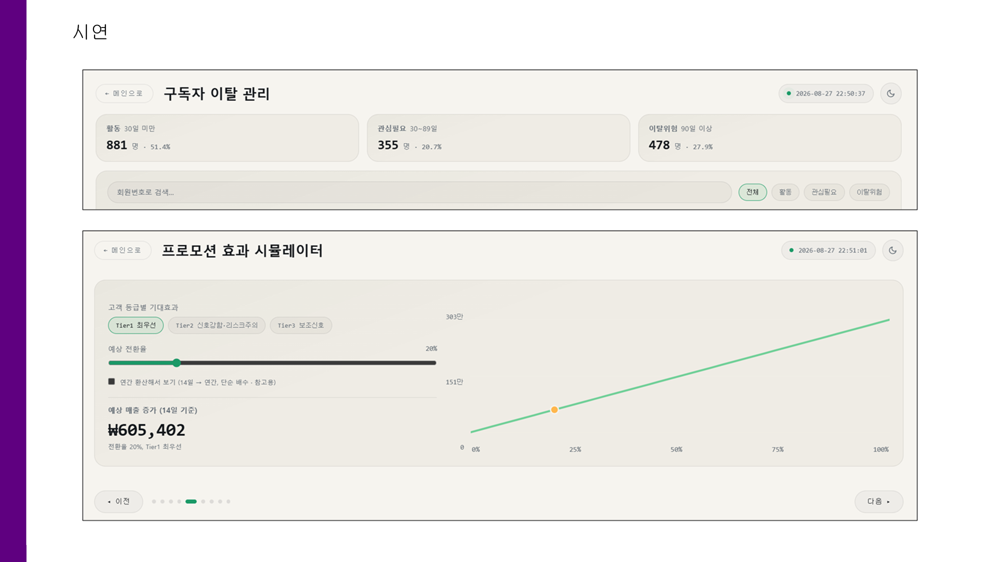

# 🛒 고객별 마케팅 효과 분석을 통한 이커머스 매출 향상
### Uplift Modeling — "누구에게 프로모션을 줘야 실제로 매출이 늘어나는가"

<sub>포스코 청년 AI·BigData 아카데미 34기 · B반 1조 &nbsp;|&nbsp; 양진우 · 임성민 · 박지훈 · 박승형 · 이선희 · 강인수</sub>


-2f6b4f)
-success)

> 전체 고객에게 뿌리던 프로모션 예산을, **"그 프로모션이 없었으면 사지 않았을 고객"** 에게만 집행하도록 재설계한 프로젝트입니다.
> 668,111행의 실거래 데이터에 Uplift Modeling을 적용해 개인별 처치효과를 추정하고,
> 접촉 대상을 **8,276명 → 418명** 으로 좁히면서 1인당 기대 효과는 **4.9–7.1배**로 끌어올린 타겟팅 리스트를 산출했습니다.

### 📊 최종 발표 자료

**▶︎ [B1조_빅데이터_이커머스_최종발표.pdf](docs/B1조_빅데이터_이커머스_최종발표.pdf)** (19장)

> 이 README는 **결과와 실행 방법**만 담습니다.
> 데이터 전처리·EDA·RFM 분석·모델링 방법론·평가 지표·인사이트 도출 과정은 전부
> **[`docs/기술_상세_문서.md`](docs/기술_상세_문서.md)** 에 있습니다.

---

## 👥 팀 & 역할

팀 전체가 **가설별로 모듈을 나눠 병렬 분석하고 하나의 공통 파이프라인으로 통합**하는 방식으로 진행했습니다. 각자 전처리를 하면 결과를 비교할 수 없기 때문에, **분석 착수 전에 EDA 결과를 취합해 전처리 규격을 먼저 합의**한 것이 협업의 핵심이었습니다.

| 역할 | 담당 | 주요 산출물 |
|---|---|---|
| **프로젝트 총괄** | 양진우 | 분석 설계·일정 관리, 파트별 결과 통합 |
| **외부 데이터 수집** | 박승형 | 기준금리·CCSI·유가·기상특보 등 외부변수 13종 결합 |
| **데이터 EDA** | 강인수 · 박승형 | 고객·구매패턴·상품 탐색 분석 |
| **데이터 전처리** | 박지훈 · 이선희 | 8-Step 공통 파이프라인, 파생변수 9종, Train/Holdout 시간분할 |
| **데이터 분석** | 박지훈 · 임성민 | 취소·재구매, 요일·시간대, 연령대별 매출 분석 |
| **RFM 고객 분석** | 이선희 | RFM 3등급 세그먼트, 등급별 혜택 설계 |
| **모델 A** — 가격·구매금액 (H1) | 양진우 | T-learner(로지스틱 L1 · RandomForest), 최종 Tier 리스트 |
| **모델 B** — 연령×성별 (H4) | 임성민 | 교호항 회귀·K-means 보조분석, Y 기준 14일 확정 |
| **모델 C** — 계절·명절 상품 (H3) | 박승형 | `제철여부` 파생 설계, 원본 결측 8일 발견, 위기서사 수치 정정 |
| **모델 D** — 지역×배송조건 (H2) | 박지훈 | 주소지 정규화·`region_key`, 지역별 구독률 2.5배 격차 발견 |
| **비즈니스 케이스 스터디** | 임성민 | 네이버페이 · Wayfair 적용 사례 조사 |
| **대시보드 구상 및 구현** | 양진우 · 이선희 | FastAPI + Streamlit 5개 탭, 매출 시뮬레이터 |
| **발표자료 제작** | 강인수 · 박지훈 | 최종 발표 덱 19장 |

---

## 01. 추진배경

친환경 신선식품 이커머스 기업(가명: *이커머스데이터*)의 사내 데이터마케팅팀 관점에서 착수한 프로젝트입니다.

| 관점 | 관측 |
|---|---|
| **신선식품 수요 증가** | 온라인 신선식품 거래액 1조 2,808억 원(2024.6) → **1조 7,000억 원(2025.6), +13.5%** |
| **멤버십 경쟁 심화** | 주요 유료 멤버십 회원 수 2021→2023년 600→1,100만 명 / 250→800만 명으로 확대 |
| **동종 업계 대비** | 자사는 **9월 이후 6.3% 추가 하락, 10월 이후 3.4% 더딘 성장** — 시장 평균보다 더 나쁨 |

**시장은 커졌는데 우리만 뒤처졌다** — 즉 외부 환경 탓으로 돌릴 수 없고, 마케팅 예산을 쓰는 *방식* 자체를 다시 봐야 한다는 것이 프로젝트의 출발점입니다.

---

## 02. Uplift 결과 — 최종 타겟팅 리스트

**모델 클래스가 서로 다른 두 모델이 동시에 상위 20%로 지목한 고객(이중검증) = 513명.** 여기에 매출 리스크 필터를 교차해 3단계로 나눴습니다.

| Tier | 인원 | 정의 | 1인당 기대 매출 Uplift | 권장 액션 |
|---|---:|---|---:|---|
| 🥇 **Tier1 최우선** | **418명** | 두 모델 모두 지목 + 매출리스크 없음 | **+7,242원** | 구독 프로모션 즉시 집행 |
| ⚠️ **Tier2 리스크주의** | **95명** | 두 모델 모두 지목 + 고가군(Q4) 매출리스크 | **−10,904원** | **구독 유도 금지** — 다른 오퍼로 전환 |
| 🥈 Tier3 보조신호 | 1,958명 | 한쪽 모델만 지목 | +2,889원 | 예산 여유 시 2차 확장 |

### 왜 Tier2를 굳이 갈라냈는가

Y를 **재구매 확률**에서 **14일 매출액**으로 바꿔 다시 추정하자 **부호가 뒤집혔습니다.**

| 기준 | 방향 |
|---|---|
| 재구매 **확률** Uplift | 🔼 **양수** (+0.68 ~ +1.55%p) |
| 재구매 **매출** Uplift | 🔽 **음수** (−621 ~ −934원) |
| └ 고가군(Q4)만 | 🔽 **−5,360 ~ −5,732원** (두 모델 방향 일치) |

정기배송 전환이 **"크고 드문 구매"를 "작고 잦은 구매"로 대체**하기 때문입니다. 전환율 단일 KPI로 캠페인을 운영했다면 **성공으로 집계되면서 실제 매출은 줄어드는** 상황이 벌어질 수 있었습니다.

Tier2의 95명은 재구매 확률만 보면 Tier1과 똑같이 매력적이지만, 매출로는 1인당 −10,904원 구간입니다. 이들을 걸러내 **약 104만 원의 기대 매출 훼손을 회피**합니다.

### 예산 효율

| 전략 | 접촉 인원 | 1인당 기대 Uplift | 기대 ROI |
|---|---:|---:|---:|
| 전체 비구독자 무차별 발송 *(현행)* | 8,276명 | 0.68–1.55%p | 0.2–0.4배 |
| 무작위 418명 *(대조군)* | 418명 | 0.67–1.55%p | 0.2–0.4배 |
| **Tier1 418명** | **418명** | **4.78–7.58%p** | **1.2–1.9배** |

- **타깃 효율 4.9–7.1배** — 동일 인원 무작위 추출(2,000회 평균)과 비교해도 같은 배수가 재현됩니다.
- **접촉 비용 94.9% 절감** — 3,000원 단가 기준 **23,574,000원 절감**.
- **어디서 멈출지도 데이터로** — Tier3까지 확장하면 ROI가 1.0 아래로 떨어집니다. "더 보내라"가 아니라 **"여기서 멈춰라"** 를 수치로 제시한 것이 이 리스트의 실질적 가치입니다.

> 📎 Qini/AUUC·부트스트랩 신뢰구간·메타러너 간 순위상관, 그리고 이 수치들이 **어디까지 통계적으로 뒷받침되는지의 경계**는 [기술 상세 문서 5-5절·6-6절](docs/기술_상세_문서.md#5-5-평가-지표--인과추론-특화-지표-적용)에 정리돼 있습니다.

---

## 03. 대시보드



FastAPI + Streamlit으로 **KPI / 프로모션 타겟팅 / 구독자 관리 / 매출 리포트 / 고객 CSV 분석** 5개 탭과 매출 시뮬레이터를 구현했습니다.

```bash
pip install -r dashboard/requirements.txt
python dashboard/backend/main.py          # http://localhost:8000  (FastAPI)
streamlit run dashboard/frontend/app.py   # http://localhost:8501  (Streamlit)
```

서버 없이 결과만 보려면 [`docs/대시보드_통합본.html`](docs/대시보드_통합본.html)을 열면 됩니다.

---

## 📁 프로젝트 구조

```
E_Commerce_Uplift_Analysis/
├── docs/
│   ├── B1조_빅데이터_이커머스_최종발표.pdf   # ★ 최종 발표 덱 (19장)
│   ├── 기술_상세_문서.md                  # ★ 전처리·EDA·모델링·검증 전 과정
│   ├── 대시보드_통합본.html               # 서버 없이 여는 정적 대시보드
│   ├── 이커머스_비즈니스모델캔버스.html      # 사내 DM팀 관점 9블록
│   └── 260320_…변수정의서(B반_이커머스).pptx  # 과제로 제공받은 원본 변수 정의서
├── src/                              # 전처리·모델링·평가 파이프라인 (실행 순서대로 번호 부여)
│   ├── preprocess_pipeline.py            # 8-Step 전처리 · Train/Holdout 시간분할
│   ├── run01b_kitchen_sink_l1.py         # T-learner 로지스틱(L1)      ★대표모델
│   ├── run08b_uplift_forest_gridsearch.py# T-learner RandomForest      ★대표모델
│   ├── run11_final_targeting_list.py     # 이중검증 → Tier1–3 산출
│   └── run24 / run25                     # Qini·AUUC 평가 · ROI 시뮬레이션
├── data/                             # 스냅샷 · 모델 출력 CSV (+ 원본 zip)
│   └── run11_final_targeting_list.csv    # ★ 최종 산출물
├── notebooks/                        # 제출용 Jupyter Notebook(실행결과 포함)
├── dashboard/                        # FastAPI + Streamlit 대시보드
├── assets/                           # 문서용 시각자료
└── requirements.txt
```

---

## 🚀 재현 방법

```bash
git clone https://github.com/YangNaang2/E_Commerce_Uplift_Analysis.git
cd E_Commerce_Uplift_Analysis

python -m venv .venv
source .venv/bin/activate      # Windows: .venv\Scripts\activate
pip install -r requirements.txt
```

리포지토리의 `data/`에 스냅샷과 모델 출력 CSV가 포함돼 있어, 아래 두 스크립트는 **원본 데이터 없이도** 평가 지표와 ROI 수치를 그대로 재현합니다.

```bash
python src/run24_qini_auuc.py      # Qini/AUUC + 부트스트랩 CI
python src/run25_targeting_roi.py  # 전략별 ROI 시뮬레이션
```

원본 데이터부터 전체 파이프라인을 재실행하려면 `data/raw_and_merged_data.zip`을 `data/`에 풀고 `src/`의 스크립트를 번호 순서대로 실행하면 됩니다.

---

## 📚 참고 문헌

- Künzel, S. R., Sekhon, J. S., Bickel, P. J., & Yu, B. (2019). *Metalearners for estimating heterogeneous treatment effects using machine learning.* PNAS, 116(10).
- Chernozhukov, V., et al. (2018). *Double/Debiased Machine Learning for Treatment and Structural Parameters.* The Econometrics Journal, 21(1).
- Wager, S., & Athey, S. (2018). *Estimation and Inference of Heterogeneous Treatment Effects using Random Forests.* JASA, 113(523).
- 김주현, 문현실 (2025). 「광고 효율성 제고를 위한 Uplift 모델 기반 모바일 광고 타겟팅 방법」. 한국경영과학회지, 50(1). [DOI](https://doi.org/10.7737/JKORMS.2025.50.1.049)
- 박대한 (2024.10.10). 「Uplift Modeling을 통한 마케팅 비용 최적화」. 네이버페이 기술블로그. [링크](https://blog.naver.com/naverfinancial/223613675333)

---

<sub>본 리포지토리는 포스코 청년 AI·BigData 아카데미 34기 교육 과정에서 수행한 팀 프로젝트 결과물입니다. 기업명은 가명이며, 데이터는 과제용으로 제공받은 것입니다.</sub>
