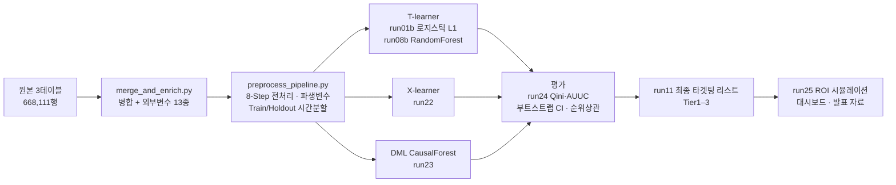

# 기술 상세 문서 — E-Commerce Uplift Analysis

> 이 문서는 [메인 README](../README.md)에서 발표 흐름에 맞춰 요약한 내용의 **전체 근거**입니다.
> 전처리 규격, 메타러너 3계열(T·X·DML) 비교, Qini/AUUC·부트스트랩 CI·순위상관 검증, ROI 시뮬레이션,
> 그리고 **어떤 결론이 어디까지 데이터로 뒷받침되는지의 경계**까지 전부 담고 있습니다.
>
> 📊 발표 자료: [`docs/B1조_빅데이터_이커머스_최종발표.pdf`](B1조_빅데이터_이커머스_최종발표.pdf)

---

## 🎯 1. 배경 & 비즈니스 문제 정의

### 1-1. 상황

친환경 신선식품 이커머스 기업(가명: *이커머스데이터*)은 2024년 분기 성장률 13→15→25→27%로 정점을 찍은 직후, 금리 인상·식자재가 급등과 함께 월매출이 15억 원대에서 10억 원대로 내려앉았습니다. 사내 데이터마케팅(DM)팀 관점에서 착수한 분석 프로젝트입니다.

실측 데이터 기준 월매출은 9월 → 10월에 **-8.8%** 감소했지만, 같은 기간 국내 온라인쇼핑 음식료품 카테고리 전체가 **-15.9%** 위축(국가데이터처)됐습니다. **자사만의 고립된 위기가 아니라 시장 전체의 하강 국면**이라는 것 — 즉 지금이 남들보다 먼저 체질을 개선할 시점이라는 것이 프로젝트의 출발점입니다.


### 1-2. 왜 반응 예측(Response Model)이 아니라 Uplift Modeling인가

일반적인 반응 예측 모델은 `P(구매 | 프로모션 O)`가 높은 고객을 고릅니다. 그런데 이 점수가 높은 고객은 대부분 **프로모션이 없어도 어차피 살 사람(Sure Thing)** 입니다. 즉 반응 예측 모델을 그대로 타겟팅에 쓰면, 이미 확보된 매출에 쿠폰을 얹어주는 **예산 낭비를 정확하게 최적화**하게 됩니다.

필요한 것은 확률이 아니라 **차이(개인별 처치효과, ITE)** 입니다.

```
Uplift(고객 X) = P(구매 | X, 프로모션 O) − P(구매 | X, 프로모션 ✗)
                 └──── 관측 가능 ────┘   └── 반사실(counterfactual), 관측 불가 ──┘
```


| 세그먼트 | 처치 시 구매 | 미처치 시 구매 | Uplift | 마케팅 관점 | 이 프로젝트의 대응 |
|---|:---:|:---:|:---:|---|---|
| 🟢 **Persuadable** | YES | NO | **(+)** | 타겟 1순위 — 프로모션이 구매를 *만들어냄* | Tier1로 분류, 예산 집중 |
| 🟡 Sure Thing | YES | YES | 0 | 어차피 구매 — **예산 낭비** | 상위 랭킹에서 배제 |
| ⚪ Lost Cause | NO | NO | 0 | 무슨 수를 써도 반응 없음 | 접촉 제외 |
| 🔴 **Sleeping Dog** | NO | YES | **(−)** | 프로모션이 구매를 *막음* — 역효과 | 음수 Uplift·매출 리스크 필터로 제외 |

### 1-3. 데이터 제약과 설계 판단 ⚠️

원본 데이터에는 **쿠폰·프로모션 노출 이력(Treatment) 컬럼이 존재하지 않습니다.** 이 제약을 우회하기 위해 Treatment를 재정의했고, 그 선택이 결론에 미치는 영향을 마지막까지 추적해 문서에 남겼습니다.

| 설계 요소 | 정의 | 판단 근거 |
|---|---|---|
| **Treatment (T)** | 멤버십(정기배송) 구독 여부 | 프로모션 노출 컬럼 부재. 대안이던 적립금 사용여부는 **자기선택편향**이 극심해 배제(적립금 사용 고객 평균 주문 25.9회 vs 미사용 3.9회, 7배 격차) |
| **Outcome (Y)** | 기준일 이후 **14일 내 재구매 여부** | 재구매 간격 분포에서 누적 80.1% 포착. 30일 기준은 양성률 88%로 ceiling effect가 발생해 세그먼트 차이가 소멸 |
| **분석 단위** | `회원번호 × index_date` 스냅샷 | 원본 1행은 "주문"이 아니라 "품목"(주문당 평균 3.34개) → 다품목·고빈도 고객 과대대표 방지 |
| **분할** | Train `index_date=9/16` / Holdout `index_date=10/26` | 랜덤 분할이 아닌 **시간 기준 분할**로 미래 정보 누수 차단 |

> 📎 Treatment가 무작위 배정이 아닌 **관측된 자기선택**이라는 점이 이 프로젝트의 가장 큰 방법론적 리스크입니다. 이를 경고 문구로 남기는 데 그치지 않고 **Double ML로 직접 스트레스 테스트한 결과**가 [6-6절](#6-6-방법론-검증-노트--dml까지-돌려본-이유)입니다.

---

## 🧹 2. 데이터 & 전처리



### 2-1. 수집 & 병합

| 구분 | 규모 |
|---|---|
| 판매 데이터 | **668,111행** |
| 고객 데이터 | 12,540행 |
| 상품 데이터 | 2,549행 |
| 외부 데이터 | 국내 온라인쇼핑 동향, 공휴일 캘린더 등 |
| **병합 결과** | **668,111 × 25** |

### 2-2. 결측 변수 처리

| 변수 | 결측률 | 처리 | 근거 |
|---|---:|---|---|
| 결혼 여부 | 21.7% | `Other` 카테고리로 유지 | 구매 행동에 유의미한 변수라 삭제·대치 대신 범주 보존 |
| 구독 여부 | 18.7% | 결측 상태 유지 | **모델링의 Treatment 변수** — 임의 대치 시 처치효과 자체가 오염됨 |

### 2-3. 파생 변수

| 변수 | 원본 | 설명 |
|---|---|---|
| `연휴전후구간` | 주문일시 + 공휴일 캘린더 | 연휴중 / 연휴직전 / 연휴직후 / 평시 4단계 |
| `명절선물세트여부` | 물품명 + 물품대분류 | 선물세트 키워드 & 식품 카테고리 동시 충족 |
| `상품중량_g` · `옵션정보` | 상품중량 | 정규식으로 중량(g·kg·ml)만 추출, 나머지는 옵션으로 분리 |
| `제철상품구매여부` | 물품중분류 + 주문월 | 월별 판매집중도 65%↑ 품목의 성수기월 일치 여부 |
| `재구매 주기` | 주문 간격 | 변동계수(CV) — 작을수록 정기구매 성향 |
| `연령대` · `연령대·성별` | 나이 + 성별 | 결합 세그먼트 |
| `가격구간` | 평균구매금액(AOV) | **Train 시점 기준** 4분할 후 고정 적용(누수 방지) |
| `이상계정 여부` | 구매빈도 | 상위 1% 계정을 별도 카테고리로 표기 |
| `14일내 재구매 여부/금액` | 기준일 이후 14일 내 주문 | **모델링의 Y 값** |

> 💡 **Y를 14일로 잡은 이유**: 재구매 간격 분포에서 누적 80.1%를 포착하는 지점입니다. 30일 기준은 양성률이 88%까지 올라가 ceiling effect가 발생하고, 세그먼트 간 차이가 소멸합니다.


### 2-4. 8-Step 파이프라인 & 데이터 정합성

8-Step 공통 파이프라인(`src/preprocess_pipeline.py`)으로 **4개 분석 파트가 동일한 스냅샷·동일한 Y·동일한 이상치 기준**을 공유하도록 설계했습니다. 각자 전처리를 하면 파트 간 결과를 비교할 수 없기 때문입니다.

| Step | 처리 | 주요 산출 |
|---|---|---|
| 0 | 무결성 검증 | 고아 레코드·중복 PK **0건** 확인, cp949 인코딩 처리 |
| 1 | 컬럼 정제 | 주소지 축약형 정규화(983건), 주문시간 포맷 오류 보정 |
| 2 | **파생변수 생성** | `basket_amt`(장바구니 재집계), `log_basket_amt`(왜도 27.4 → 0.43), `가격구간`(AOV 4분위), RFM(`frequency`/`monetary`/`recency_days`/`regularity_cv`), `제철여부`·`계절성지수`, `region_tier`, `age_gender_segment`, `treatment_h4`, `y_repurchase_14d` |
| 3 | 이상치 **플래그**(삭제 아님) | `abnormal_account_flag`(주문 500건 초과 또는 상위 1%) — 4개 파트가 공통 참조 |
| 4 | 결측 처리 | 결혼 21.7% 대치 금지, 구독여부 결측 18.7%는 행동 기반 재분류를 시도했으나 **분류 성능이 랜덤 수준이라 unresolved로 격리**(억지 대치 대신 분석 제외) |
| 5 | 인코딩·스케일링 | OneHot + StandardScaler, 소표본 지역 스무딩 |
| 6 | Train/Holdout 시간분할 | 라벨 관측 가능성(N=14일)을 고려한 cutoff 적용 |
| 7 | 최종 검증 | 기존 브리핑 수치 재현 `assert` |

**데이터 정합성 관리 — 파이프라인이 잡아낸 3건**

1. **품목행 ≠ 주문**: 668,111 품목행 = 실제 191,018 주문(주문당 3.34품목). 두 명의 팀원이 서로 다른 코드로 재집계해 **191,018건으로 정확히 일치**하는 것을 교차검증했습니다.
2. **원본 데이터 자체의 결측 8일**(10/3, 10/11–12, 11/10–14). 이 중 **11/10–14 닷새가 최초 Holdout(11/2 기준)의 라벨 관측창 한가운데와 겹쳐** 재구매율이 과소추정되고 있었습니다 → **Holdout 기준일을 10/26으로 재설정하고 영향받는 모델을 전부 재실행**(재구매율 26.9% → 34.3%로 정정, Uplift 추정치 자체는 안정적으로 재현).
3. **완전 다중공선성**: `monetary = frequency × aov` 항등식 때문에 `log_monetary`가 `log_frequency`+`log_aov`에 완전 종속 → `log_aov` 제거 후 재실행.

## 🔍 3. 탐색적 분석 (EDA)

### 3-1. 고객 정보 — 상위 1%는 이상치가 아니라 기업고객

구매빈도 상위 1% 계정은 평균 주문건수·총구매액이 정상 계정을 크게 상회합니다. 통계적으로는 이상치지만, 프로파일을 보면 **기업고객으로 추정**돼 **삭제하지 않고 별도 카테고리로 플래그** 처리했습니다. 매출은 **30·40대 여성**에 집중돼 있어, 주요 고객층 맞춤형 프로모션의 근거가 됩니다.

### 3-2. 구독자 — 미구독 67%, 그리고 구독자 안의 이탈 신호

| 기준 | 값 | 의미 |
|---|---|---|
| 기준 1 | 30일 | 한 달 구독기간 |
| 기준 2 | 90일 (1분기) | 이탈 판정 구간 설정 |
| 기준 3 | **90일 이상 미구매 = 28.6%** | 구독자 중 이탈위험군 |

미구독 67%를 전환시키려면, 먼저 **이미 구독 중인 고객이 어떻게 반응하는지**를 파악해야 합니다. 이것이 뒤이은 Uplift 모델링에서 구독 여부(T)를 Treatment로 설정한 배경입니다.

### 3-3. 구매 패턴 — 취소 후 복귀는 7일 안에 결정된다

주문 취소 고객의 이후 행동은 **7일 이내 재구매 51% / 7일 이후 재구매 11% / 재구매 안 함 38%** 로 갈립니다. 돌아오는 고객의 대부분이 **첫 7일 안에** 돌아온다는 뜻이므로, 대응 타이밍이 곧 성과입니다.

- **30세 미만 여성** — 취소 직후 리마인드 알림
- **30·40대 여성** — 재구매 유도 캠페인

### 3-4. 구매 패턴 — 언제 보낼 것인가

- 매주 **금요일** 주문량 피크가 반복 → 하루 앞선 **목요일**에 프로모션 발송
- **오전 11–12시** 점심 피크 직전에 리마인드 알림 배치

### 3-5. 상품 — 반복구매 기반을 확보할 자사 브랜드 후보

연령대별 매출은 30대 24.98억 · 40대 23.56억 · 50대 12.30억 · 60대+ 8.39억 · 30세 미만 5.86억 원입니다. 30·40대 매출 기여 TOP5는 **논지엠오유정란 2.06억**, 멥쌀 1.54억, 추출/농축액 1.53억, 돼지 1.22억, 한우 1.17억 원.

> **자사 브랜드 추진 근거**: 상위 품목의 평균 단가는 전체 평균과 거의 같습니다. **비싸서 매출 1위가 아니라 자주 팔려서** 1위라는 뜻이므로, 자사 브랜드로 전환하면 반복 구매 기반을 그대로 확보할 수 있습니다.

---


## 🏅 4. RFM 고객 분류와 그 한계

R(최근성)·F(빈도)·M(구매금액) 점수를 합산(3~15점)한 뒤 **인원 기준으로 정확히 3등분**했습니다.

| 등급 | 인원 | 인원 비중 | 매출 비중 | 목적 | 혜택 설계 |
|---|---:|---:|---:|---|---|
| 핵심고객 | 3,911명 | 33.3% | **83.1%** | 이탈 방지 | 무료배송 · 적립 10% · 우선 배송(당일 도착) |
| 일반고객 | 3,910명 | 33.3% | 13.9% | 혜택 극대화 | 무료배송 · 적립 7% · 추가 할인 쿠폰 |
| 관리필요고객 | 3,911명 | 33.3% | 2.9% | 승급 자극 | 배송비 별도 · 적립 3% · 승급 진행률 안내 |

인원을 정확히 3등분했는데도 **매출의 83%가 한쪽에 몰려 있습니다.**

> ⚠️ **그리고 여기서 한계에 부딪힙니다.**
> **RFM은 "누가 중요한지"는 알려주지만, "누구에게 줘야 효과가 있는지"는 알려주지 못합니다.**
> 핵심고객은 어차피 살 사람일 수 있고, 그들에게 쿠폰을 주는 건 **이미 확보된 매출에 비용을 얹는 것**입니다. 이 질문에 답하기 위해 Uplift Modeling으로 넘어갔습니다.

---


## 🏗️ 5. Uplift 모델링

### 5-1. 무엇을 재는 기법인가

```
UpLift(X) = A(X) − B(X)
          = (구독 시 예상 재구매율) − (미구독 시 예상 재구매율)
```

| 고객 유형 | 구독하면 구매? | 비구독이어도 구매? | 마케팅 판단 |
|---|:---:|:---:|---|
| 🟢 **유입 가능 고객** | YES | NO | **타겟 1순위** — 프로모션이 구매를 *만들어냄* |
| 🟡 기존 확보 고객 | YES | YES | **예산 낭비** — 어차피 구매 |
| ⚪ 무반응 고객 | NO | NO | 효과 없음 |
| 🔴 **역효과 고객** | NO | YES | **반드시 제외** — 프로모션이 구매를 *막음* |

| 설정 | 정의 |
|---|---|
| **T (Treatment)** | 구독(멤버십) 여부 |
| **Y (Outcome)** | 14일 내 재구매 여부 |

> 원본 데이터에 쿠폰·프로모션 노출 이력 컬럼이 없어, **구독 여부를 Treatment로 재정의**했습니다. 그 판단 근거는 [1-3절](#1-3-데이터-제약과-설계-판단-️), Double ML로 스트레스 테스트한 결과는 [6-6절](#6-6-방법론-검증-노트--dml까지-돌려본-이유)에 있습니다.

### 5-2. 비즈니스 케이스 스터디 — 실제로 쓰이는 기법인가

| | 사례 |
|---|---|
| **CASE 1** | **네이버페이** 인텔리전스서비스팀이 마케팅 비용 최적화 문제를 Uplift Modeling으로 정의하고 실제 프로모션 타겟팅 모델에 적용 — 박대한(2024.10), 네이버페이 기술블로그 |
| **CASE 2** | **Wayfair** 가 인과추론·Uplift 기반 시뮬레이션으로 **연간 약 8천만~1억 달러**의 추가 매출 잠재효과를 추정 — Wayfair Tech Blog |

### 5-3. 모델 구조 — T-learner

구독자(T=1) **Train 1,626명** / 비구독자(T=0) **Train 7,895명** 으로 **arm별 독립 모델**을 학습한 뒤, 두 예측의 차이를 **비구독자 8,276명**에게 계산했습니다.

| 모델 | 특징 |
|---|---|
| 로지스틱 회귀 (L1) | 29개 특징 중 **4개만 자동 채택** — 과적합 억제 |
| 랜덤 포레스트 | 트리 앙상블로 **특징 간 상호작용 포착** |

다양한 모델을 적용한 뒤 성능이 좋은 **상위 2개 모델을 채택**했습니다. 서로 성격이 다른 두 모델을 남긴 것이 다음 절의 이중검증으로 이어집니다.


### 5-4. 모델링 전략 — 메타러너 3계열 교차검증

| 메타러너 | 구현 | 채택 | 판단 근거 |
|---|---|:---:|---|
| **S-learner** | Treatment를 피처 하나로 투입 | ❌ | Treatment 신호가 약하면 모델이 T를 사실상 무시해 **Sure Thing만 골라내는 함정**. 본 데이터는 처치군 학습표본이 1,626명뿐이라 이 위험이 큼 |
| **T-learner** | 구독자/비구독자 arm별 독립 모델 → 예측차 | ✅ **메인** | `run01b` 로지스틱(L1 자동 피처선택) + `run08b` RandomForest(GridSearchCV) 2종. arm별 Holdout AUC 0.869–0.883 |
| **X-learner** | ITE 대체(impute) 후 성향점수 가중 | ✅ 교차검증 | 대조군 8,276명 ≫ 처치군 3,456명의 **불균형 구조에서 이론적으로 유리**(`run22`) |
| **DML (CausalForestDML)** | 결과·처치 모델 잔차 직교화 | ✅ 스트레스 테스트 | 관측 데이터의 confounding을 **명시적으로** 통제(`run23`) |

**모델링 과정에서 확인한 것 — "AUC 올리기"와 "Uplift 안정화"는 다른 문제**

- 피처를 늘리면 각 arm의 AUC는 그대로거나 오히려 하락하는데 **Uplift 추정 노이즈는 2–2.5배로 증가**했습니다(처치군 표본 과소로 인한 과적합). → 수동 피처 선별 대신 **L1 자동선택**을 채택(29개 인코딩 피처 중 4개 생존: `log_frequency`·`log_recency`·`log_monetary`·`성별`/적립금 이력 계열).
- RandomForest를 GridSearchCV로 정식 재튜닝해 arm AUC를 올려도(0.883/0.869) **Uplift 추정치의 표준편차(4.44%p)는 줄지 않았습니다.** 개별 arm의 예측 정확도 향상이 두 예측의 *차이*의 안정성까지 보장하지는 않는다는 것을 실증한 사례입니다.

### 5-5. 평가 지표 — 인과추론 특화 지표 적용

정확도(AUC)는 "구매할 사람"을 맞히는 지표일 뿐, "프로모션으로 마음이 바뀔 사람"의 랭킹 품질을 말해주지 않습니다. 그래서 아래 4개 축으로 평가했습니다.

**① Qini 곡선 & AUUC** (`src/run24_qini_auuc.py`) — Holdout 9,990명(처치군 1,714 / 대조군 8,276) 실측


| 모델 | Qini 계수 | 부트스트랩 95% CI | AUUC | 상위 20% 증분전환 | 상위 20% 포착률 |
|---|---:|---|---:|---:|---:|
| T-learner 로지스틱 (run01b) | **-4.66** | [-15.94, 5.81] | 5.63 | -12.3명 | 무작위 이하 |
| T-learner RandomForest (run08b) | **+11.29** | [-1.34, 24.10] | 21.59 | +11.3명 | **54.9%** |
| X-learner (run22) | +2.78 | [-10.62, 15.73] | 13.08 | +8.1명 | 39.5% |
| DML CausalForest (run23) | **+11.29** | **[0.16, 23.65]** | 21.59 | +8.8명 | 42.6% |

*Qini(k) = Y_t(k) − Y_c(k)·N_t(k)/N_c(k) — 상위 k명을 타겟팅했을 때 대조군 대비 추가로 얻는 누적 전환수. 전체 증분전환은 20.6명. RF와 DML의 AUUC가 같아 보이는 것은 반올림 결과이고(21.587 vs 21.589) 곡선 형태는 서로 다릅니다.*

**이 표에서 읽어야 할 것 세 가지**

1. **트리 계열(RF·DML)은 상위 20% 안에 전체 증분 전환의 42–55%를 담아냅니다**(무작위라면 20%). 상위 20%만 접촉해도 증분의 절반 가까이를 회수한다는 뜻이며, 6-2절 ROI 시뮬레이션의 근거가 됩니다.
2. **로지스틱 단독 랭킹은 Qini 기준 무작위 이하입니다.** 로지스틱을 단독 타겟팅 근거로 쓰지 않고 **두 모델이 동시에 지목한 교집합만 신뢰하는 이중검증 설계**([6-3절](#6-3-최종-타겟팅-리스트--tier-13))로 간 것이 이 관측과 정합합니다.
3. **모든 CI가 넓고 대부분 0을 포함합니다.** 처치군 1,714명·전체 증분 전환 20.6명이라는 표본에서 Qini는 애초에 통계적 파워가 부족합니다. 또한 Qini/AUUC는 원래 **RCT를 전제한 지표**이므로, 여기서의 값은 "실험으로 보증된 증분"이 아니라 **모델 간 랭킹 품질의 상대 비교치**로만 해석합니다. 이 지표를 계산한 목적도 순위를 매기기 위해서가 아니라, 어떤 결론까지 데이터가 지지하는지 경계를 긋기 위해서입니다.

**② 부트스트랩 신뢰구간** — 평균 Uplift를 점추정치가 아니라 구간으로 보고(T-learner +0.68%p [0.62, 0.73] / +1.55%p [1.45, 1.64], X-learner +1.47%p [1.36, 1.58]).

**③ 메타러너 간 합의도 (Spearman 순위상관 · Top-20% Jaccard)** — 단일 모델에서만 나온 우연을 배제하기 위한 재현성 검증.

| 비교 | 순위상관 | 상위 20% 겹침(무작위 대비) |
|---|---:|---:|
| T-learner(RF) ↔ X-learner | **0.80** | 3.34배 |
| T-learner(RF) ↔ DML | 0.25 | 1.92배 |
| T-learner 로지스틱 ↔ RandomForest *(같은 담당자, 다른 모델 클래스)* | **0.089** | 1.6배 |
| **T · X · DML 3종 만장일치 상위 20%** | — | **7.3배** (482명) |

> 💡 **팀 전체 8개 모델을 비교해 얻은 발견**: 개인별 Uplift 순위는 "어떤 가설을 담당했는가"(가격/연령성별/계절/지역)보다 **"로지스틱이냐 RandomForest냐"에 훨씬 더 크게 좌우**됩니다(RF끼리 0.82–0.86 vs 같은 사람의 로지스틱↔RF 0.06–0.09). 이 발견이 최종 타겟팅 로직을 "단일 최고 모델 선택"이 아니라 **"모델 클래스가 다른 두 모델의 교집합"** 으로 설계한 직접적인 근거입니다.

**④ arm별 Holdout AUC** — T-learner를 구성하는 개별 모델의 건전성 확인(0.869–0.883). 하이퍼파라미터 튜닝·회귀계수/피처중요도·혼동행렬·ROC를 함께 점검했습니다.


---

## 💰 6. 핵심 결과 & 비즈니스 임팩트

### 6-1. 모델 리더보드 — Holdout(10/26) 기준 전체 결과

| Run | Y (대상) | 모델 | 평균 Uplift | 95% CI | 판정 |
|---|---|---|---:|---|---|
| **run01b** | 재구매(binary) | 로지스틱 (L1 자동선택) | **+0.68%p** | [0.62, 0.73] | 대표 모델, 유의 |
| **run08b** | 재구매(binary) | RandomForest (GridSearchCV) | **+1.55%p** | [1.45, 1.64] | RF 계열 대표값, 유의 |
| run06 | 매출(14일 금액) | ElasticNet | −934원 | [−1157, −717] | 유의(음수) |
| run06 | 매출(14일 금액) | RandomForest | −621원 | [−1258, 3] | 유의(음수) — 특히 Q4 −5,360 ~ −5,732원 |
| run07 | 재구매(이탈위험군) | 로지스틱 L1 | 구간별 상이 | — | **결론 유보** — RF와 방향 불일치 |
| run07 | 재구매(이탈위험군) | RandomForest | 구간별 상이 | — | **결론 유보** — 로지스틱과 방향 불일치 |

**종합 판정**: 구독은 재구매 확률은 유의하게 올리지만(+0.68–1.55%p), 매출액 기준으로는 오히려 낮추는 경향(−621 ~ −934원, 고가군 −5,400원+)이 있습니다. 어느 가격구간이 1등인지, 이탈위험군에서 효과가 더 큰지는 모델에 따라 결론이 갈려 확정하지 않았습니다. 그래서 최종 전략이 "세그먼트 랭킹"이 아니라 **개인별 Uplift 점수 기반 타겟팅 + 매출 관점 필터링**으로 수렴합니다.

> Holdout 재설정으로 전체 재구매율은 26.9% → 34.3%로 올랐지만 **Uplift 추정치 자체는 거의 그대로 재현**됐습니다. 결측이 구독자·비구독자 양쪽에 비슷하게 영향을 줘서 상대 지표는 왜곡이 적었던 것으로 보입니다.

### 6-2. ROI 시뮬레이션 — 예산 효율 개선

`src/run25_targeting_roi.py` · 가정: 접촉 단가 3,000원/인, 증분 전환 1건당 기대매출 74,887원(Holdout 실측), 기대 증분 전환수 = 그룹 내 개인별 ITE 추정치의 합(로지스틱–RF 두 모델로 범위 산출)

| 전략 | 접촉 인원 | 접촉 비용 | 기대 증분전환 | 1인당 증분전환율 | **ROI** | 손익분기 단가 |
|---|---:|---:|---:|---:|---:|---:|
| ① 전체 무차별 발송(현행) | 8,276명 | 24,828,000원 | 56.0–128.0명 | 0.68–1.55%p | 0.2–0.4배 | 506–1,158원 |
| ② 무작위 418명 | 418명 | 1,254,000원 | 2.8–6.5명 | 0.67–1.55%p | 0.2–0.4배 | 502–1,158원 |
| ③ **Tier1 418명** | **418명** | **1,254,000원** | **20.0–31.7명** | **4.78–7.58%p** | **1.2–1.9배** | **3,576–5,678원** |
| ④ Tier1+Tier3 2,376명 | 2,376명 | 7,128,000원 | 68.5–89.9명 | 2.88–3.78%p | 0.7–0.9배 | 2,158–2,834원 |

- **타깃 효율 4.9–7.1배**: Tier1의 1인당 기대 Uplift(4.78–7.58%p)는 무차별 발송 평균(0.68–1.55%p)의 4.9–7.1배입니다. 동일 인원의 무작위 추출(2,000회 평균)과 비교해도 같은 배수가 재현돼, 우연으로는 설명되지 않습니다.
- **접촉 비용 94.9% 절감**: 8,276명 → 418명. 3,000원 단가 기준 **23,574,000원 절감**하면서 기대 증분 전환은 무차별 발송의 25–36% 수준을 유지합니다(*비용은 1/20, 성과는 1/3–1/4*).
- **손익분기 관점의 결론**: 무차별 발송은 접촉 단가가 **1,158원**만 넘어도 적자입니다. 실제 구독 유도 쿠폰 단가가 그보다 높다는 점을 감안하면 **현행 방식은 구조적으로 손실**이며, Tier1 타겟팅(손익분기 3,576–5,678원)만이 흑자 구간에 들어옵니다.
- **어디서 멈출지도 데이터로**: ④처럼 Tier3까지 확장하면 ROI가 1.0 밑으로 떨어집니다. "더 많이 보내라"가 아니라 **"여기서 멈춰라"를 수치로 제시한 것**이 이 리스트의 실질적 가치입니다.

### 6-3. 최종 타겟팅 리스트 — Tier 1–3

모델 클래스가 서로 다른 두 모델(`run01b` 로지스틱 ∩ `run08b` RandomForest)이 **동시에 상위 20%로 지목한 고객(이중검증)** 에 **매출 리스크 필터**(고가군 Q4는 매출 Uplift가 음수)를 교차해 3단계로 산출했습니다. 타겟 후보(비구독자) 8,276명 기준 — `src/run11_final_targeting_list.py`

> Tier별 인원·기대효과·권장 액션은 [메인 README 06절](../README.md#06-최종-타겟팅-리스트--tier-13)에 정리돼 있습니다. 여기서는 **그 리스트가 어떻게 도출됐는지**만 다룹니다.

- 이중검증을 통과한 513명(Tier1+2)은 두 모델이 우연히 겹칠 기대치(331명)의 **1.6배**입니다.
- **Tier2의 존재가 이 리스트의 핵심 차별점**입니다. 재구매 확률만 보면 Tier1과 똑같이 매력적인 95명이지만, 매출 관점에서는 1인당 -10,904원의 손실 구간입니다. 이들을 걸러내 **약 104만 원의 기대 매출 훼손을 회피**합니다. 반응 예측 모델이었다면 이 95명은 최우선 타겟으로 분류됐을 것입니다.
- 원자료: [`data/run11_final_targeting_list.csv`](../data/run11_final_targeting_list.csv)

### 6-4. 반전 인사이트 — "구독은 재구매를 늘리지만 객단가를 줄인다"

Y를 **재구매 확률**에서 **14일 매출액**으로 바꿔 다시 추정하자 부호가 뒤집혔습니다(`run06`).

| 기준 | 선형 모델(로지스틱/ElasticNet) | RandomForest | 방향 |
|---|---:|---:|:---:|
| 재구매 **확률** Uplift | +0.68%p [0.62, 0.73] | +1.55%p [1.45, 1.64] | 🔼 양수·유의 |
| 재구매 **매출** Uplift | -934원 [-1157, -717] | -621원 [-1258, 3] | 🔽 음수·유의 |
| └ 고가군(Q4)만 | **-5,360 – -5,732원** | **-5,360 – -5,732원** | 🔽 두 모델 방향 일치 |

정기배송 전환이 **"크고 드문 구매"를 "작고 잦은 구매"로 대체**하면서, 재구매 횟수는 늘어도 순매출은 깎일 수 있다는 해석입니다. 전환율 단일 KPI로 캠페인을 운영했다면 **성공으로 집계되면서 실제 매출은 감소하는** 상황이 발생할 수 있었습니다. 이 발견이 Tier2 필터의 근거이며, 이 프로젝트에서 실무적 가치가 가장 큰 결과입니다.

### 6-5. 가설 검증 (H1–H4) & 부수 성과

| 가설 | 담당 | 판정 | 근거 |
|---|:---:|:---:|---|
| **H1** 가격 민감도(구매금액 구간)별 반응 차이 | 양진우 | **부분 지지** | 평균 효과는 유의하나 1위 구간이 로지스틱 Q3 ↔ RF Q4로 불일치(재튜닝해도 유지 → 모델 클래스 차이) |
| **H2** 지역×배송조건 | 박지훈 | **기각** | 교호항 Train p=0.624. 지역별 리드타임 차이가 최대 0.05일에 불과 |
| **H3** 계절성 상품 반응 | 박승형 | **기각** | 11개월 중 8월만 유의하고 방향도 가설과 반대(-6.5%) |
| **H4** 연령×성별(30대 여성 최대 예상) | 임성민 | **기각** | LR test p=0.65(Train)/0.32(Holdout), 30s_F는 오히려 하위권 |

**가설별 세부 근거 (교호항 회귀 · 보조분석)**

- **H4 (연령×성별)** — 교호항 결합 유의성 Train p=0.650 / Holdout p=0.324. 가설상 최대 효과를 기대한 `30s_F`의 조정 효과는 Train +0.60%p [−2.90, 4.10] · Holdout +0.87%p [−2.21, 3.95]로 둘 다 0을 포함합니다. 점추정치가 가장 큰 쪽은 오히려 남성 세그먼트(40s_M +12.1%p 등)였지만 **세그먼트당 구독자가 10–32명뿐**이라 CI가 −10 ~ +33%p로 벌어져 결론으로 삼지 않았습니다.
- **H4 보조 K-means** (K=3, silhouette 0.387) — 연령×성별보다 **구매활성도(frequency·monetary·recency)가 고객군을 훨씬 뚜렷하게 가릅니다.** 활성 군집(빈도 중앙값 29회·최근성 3일)의 재구매율은 82.2%, 비활성 군집(빈도 1회·최근성 115일)은 8.4%입니다. 인구통계 세그먼트 대신 RFM 기반 개인별 접근으로 간 선택을 독립적으로 뒷받침합니다.
- **H3 (계절성)** — `구독여부 × 제철상품구매여부` 교호항이 11개월 중 **8월 한 달만 유의**하고 방향도 가설과 반대(−6.5%)입니다. 물품중분류별로도 일관성이 없었습니다.
- **H3 부산물 — 전처리 버그 발견**: 원본 `연휴전후구간` 라벨이 실제 2025년 추석(10/3–10/9, 대체공휴일 10/8 포함)과 어긋나 있었습니다. 실제 공휴일인 10/6–10/8이 "연휴직전"으로, 연휴 안쪽 주말(10/4–10/5)이 "연휴직후"로 잘못 태깅됐고, **"연휴직후" 라벨에 목요일이 단 1건도 없어**(목요일은 회귀계수 약 −45%, p<0.001로 원래 매출이 낮은 요일) 요일 구성 편향이 결과를 왜곡하고 있었습니다. 파이프라인이 추석을 9/29–10/1로 설정한 버그를 수정하고 병합 데이터를 재생성했습니다.

> **4개 가설이 모두 무너진 것이 오히려 최종 전략의 근거가 됐습니다.** 인구통계·지역·계절 같은 **사전 정의 세그먼트로는 처치효과의 이질성을 설명할 수 없다**는 것이 다중 모델·통제변수 확장으로 반복 검증됐고, 그래서 "세그먼트를 나눠 다르게 대우하라"가 아니라 **"개인별 Uplift 점수로 순위를 매겨라"** 가 데이터로 뒷받침되는 유일한 결론이 됩니다.

**부수 성과 — 기존 위기 서사 수치의 정정**: 사내에서 통용되던 "추석 직후 매출 -63.8%"는 **요일효과가 통제되지 않은 원시 비교**였습니다. 실제 공휴일 캘린더 기준으로 요일을 매칭해 재검증한 결과 **-28.5%(대응표본 t검정 p=0.012)** 이며, 낙폭이 **주말에 집중**(토 -54.4%, 일 -58.2% vs 평일 -4 – -26%)됩니다. → 명절 프로모션 예산을 연휴 전체가 아니라 **연휴 내 주말 구간에 집중 배정**하라는 실행 권고로 이어졌습니다.

**추가 분석**: VIP 전환 예측 모델(Test AUC 로지스틱 0.854 / RF 0.881, `run13`), 신선식품×배송지역 카이제곱(p=0.030으로 유의하지만 **Cramer's V=0.0033** → "통계적 유의 ≠ 실무적 의미"의 교과서적 사례, `run12`), RFM 세그먼트·코호트 리텐션·연관규칙·결제수단·지역매출(`run14`–`run19`).

### 6-6. 방법론 검증 노트 — DML까지 돌려본 이유

T/X-learner는 결과 모델만 사용할 뿐, "누가 스스로 구독을 선택했는가"의 불확실성(성향점수)은 반영하지 않습니다. 관측 데이터에서 이 차이가 실제로 결론을 가르는지 확인하기 위해 EconML `CausalForestDML`로 재검증했습니다(`run23`).

| 지표 | T-learner (run08b) | X-learner (run22) | **DML (run23)** |
|---|---:|---:|---:|
| 평균 Uplift | +1.55%p | +1.47%p | +0.86%p |
| 95% CI | [1.45, 1.64] *(부트스트랩)* | [1.36, 1.58] *(부트스트랩)* | **[-4.37, 6.10]** *(점근적 CI, **0 포함**)* |
| T-learner와 순위상관 | — | 0.80 | 0.25 |
| 상위 20% 겹침(무작위 대비) | — | 3.34배 | 1.92배 |

**해석**: 성향점수 추정의 불확실성까지 반영하면 **"구독이 평균적으로 재구매를 유의하게 늘린다"고 단정하기 어렵습니다.** T/X-learner의 좁은 CI는 개인별 예측값 평균의 표본변동만 반영한 것이라 과신(overconfident)이었을 가능성이 있습니다.

**동시에, 타겟팅 전략의 전제는 세 메타러너 모두에서 살아남았습니다**: 상위 20% 겹침이 무작위 대비 1.9–3.3배, 3종 만장일치 그룹은 482명으로 무작위 기대치의 **7.3배**입니다. 즉 *"고객마다 반응이 다르고 그중 일부는 뚜렷하게 반응한다"* 는 명제는 일관되게 재현됩니다. 최종 타겟팅(Tier1–3)은 애초에 **평균 효과가 아니라 개인별 순위**에 기반하므로 이 결론에 좌우되지 않으며, 발표·보고서에서는 평균 효과를 단정하는 대신 **"T/X-learner 기준으로는 유의했으나, selection bias를 명시적으로 통제하는 DML로는 확정하기 어렵다"** 는 표현을 사용합니다.

> 📌 이 절은 프로젝트에서 **가장 공들인 부분**입니다. 좋아 보이는 숫자를 지키는 대신 그 숫자가 어디까지 견디는지 스스로 검증하고, 살아남은 결론과 그렇지 않은 결론을 구분해 문서에 남기는 것이 실무에서 신뢰할 수 있는 분석이라고 판단했습니다.

---

## 🎯 7. 인사이트 & 액션 플랜

| 대상 | 규모 | 액션 | 타이밍 | 근거 |
|---|---:|---|---|---|
| 구독자 이탈위험 | 478명 | 이탈 방지 리텐션 캠페인 | 즉시 | 90일 이상 미구매 · 구독자의 27.9% |
| 취소 발생 고객 | 30,635건 | 취소 직후 리마인드(30대 이하 女) / 재구매 캠페인(40대 女) | 취소 후 7일 이내 | 돌아오는 고객의 78%가 7일 내 복귀 |
| 기업고객 계정 | 119명 | B2B 대량구매 전용 오퍼 신설 | 중기 | 객단가·구매액 모두 정상계정 상회 |
| **Tier1 최우선** | **418명** | **구독 전환 오퍼 집중 집행** | **목요일 · 오전 11–12시** | 이중검증 통과 + 매출리스크 없음 |
| Tier2 리스크주의 | 95명 | 고객 등급제 혜택으로 전환 | 개별 협의 | Q4 매출 Uplift −5,732원 |
| Tier3 보조신호 | 1,958명 | 예산 여유 시 2차 확장 | 1차 성과 확인 후 | 한쪽 모델만 지목 — 신호 약함 |

**로드맵**

| 기간 | 과제 | 내용 |
|---|---|---|
| **단기** | Tier1 파일럿 집행 | 418명 대상 A/B 테스트로 실제 전환율을 측정해 모델 예측치를 검증 |
| **중기** | 유정란 자사 브랜드 론칭 | 매출 1위이자 30·40대 최다구매 품목을 축으로 자사 브랜드 구축 |
| **상시** | 대시보드 운영 | 타겟 리스트를 주기적으로 재산출해 이탈 신호를 상시 모니터링 |

---

## 🤝 8. 협업 규격 — 모델 A–D가 같은 기준을 공유하기 위해

> 누가 무엇을 맡았는지는 [메인 README의 역할분담표](../README.md#-팀--역할)에 있습니다. 이 절은 **여러 사람이 병렬로 분석하면서도 결과를 비교 가능하게 만든 기술적 장치**만 다룹니다.

**통합 규격 (모델 A–D 공통 준수)**

- 동일 스냅샷(`snapshot_train/holdout.csv`) · 동일 Y(`y_repurchase_14d`) · 동일 Treatment(`treatment_h4`) · 동일 필터(`include_in_uplift_model==1`)
- 이상거래계정 플래그는 **Step3에서 한 번만 생성**해 네 모델이 공유(각자 만들면 기준이 달라져 정합성이 깨짐)
- 네 모델이 제출한 CSV의 `treatment_h4` 값이 완전히 일치하는지 `run09`에서 교차 검증

**검증 과정에서 스스로 걸러낸 지표**: Holdout을 10/26으로 재설정한 뒤, 네 모델의 개인별 점수를 새 기준으로 통일해 "만장일치 Persuadable" 지표를 산출해 봤습니다. 그러나 이때 사용한 네 결과가 사실상 **같은 방법론의 변형**이라 서로 필요 이상으로 닮아 있었고, 그 탓에 **만장일치 인원이 인위적으로 부풀려진다**는 것을 확인했습니다(실측 161–454명 → 통일 산출 898–910명, 무작위 기대치 대비 68배). 보기 좋은 숫자였지만 **최종 근거에서 제외**하고, 타겟팅은 100% 실측 기반인 모델 A의 두 모델 이중검증(513명, 무작위 대비 1.6배)으로 대체했습니다. 그 결과 발표 자료의 모든 수치를 단서 조항 없이 인용할 수 있게 됐습니다.

---

## 📎 부록 A. 외부변수 13종 출처 & 한계

`merged_master.csv`에 결합한 외부 거시·계절 변수입니다. 데이터 기간(주문일시 2025-01-11 – 2025-11-16)에 맞춰 조사했고, **전 항목 결측 0건**을 `.isna().sum()`으로 전수검증했습니다.

| 변수 | 값 / 방식 | 출처 | 한계 |
|---|---|---|---|
| 계절 | 주문월 기준 계산(봄3-5/여름6-8/가을9-11/겨울12-2) | 파생 | — |
| 기준금리(%) | 1/11–2/24 3.00% · 2/25–5/28 2.75% · 5/29–11/16 2.50% | 한국은행 기준금리 추이·금통위 일정 | 공식 "변경일자"에 2회(2/25·5/29)만 등재돼 나머지 회차는 동결로 간주 |
| 신선식품지수_전월대비(%) | 11개월 전부 실측 | 통계청 월별 소비자물가동향 | 결측 없음 |
| 소비자심리지수(CCSI) | 11개월 확보 | 한국은행 소비자동향조사 | 7개월 직접 확인, 4개월(1·4·8·10월)은 인접월 공식 발표문의 "전월대비 Xp" 문구로 역산 |
| 두바이유 평균유가($/배럴) | 11개월 실측 | IndexMundi Dubai Fateh Crude Oil | KEEI 분기평균과 ±3달러 이내로 교차검증 |
| 농축수산물지수_전월대비(%) | 11개월 확보 | 통계청 CPI 소분류 | 1월(최근값 연장)·3월(선형보간) 2개월만 보간, 나머지 9개월 실측. 보간 여부는 별도 플래그 컬럼으로 표기 |
| 합계출산율 | 0.80명(2025 연간, 전 기간 균등 적용) | 정책브리핑 출생·사망 통계(잠정) | 월별 환산이 어려워 연간값을 보수적으로 적용 |
| 폭염·한파·집중호우 특보 | 폭염 7/15–8/25 · 한파 1/24–1/29 · 집중호우 6/12–7/31 | 보도 종합 | **근사치.** 기상자료개방포털의 지역별 일단위 원자료에 접근하지 못해 보도된 집중 시기를 하나의 구간으로 근사 |
| 연휴여부 | 2025년 공휴일·대체휴일 전체 | 공휴일 캘린더 | 데이터 기간 밖(12/25) 제외, 토요일 중복 공휴일 미보정 |

> **삭제한 변수**: `원자재_식자재_가격지수` — 이 이름의 단일 공식 통계가 존재하지 않음을 확인하고 농축수산물지수로 완전 대체했습니다.
>
> 정밀도를 더 높이려면 농축수산물 1·3월 정확한 수치는 통계청 원문(hwp/pdf) 직접 열람이, 기상 특보의 일단위 데이터는 기상자료개방포털 직접 조회가 필요합니다. 두 경로 모두 동적 렌더링·로그인 요구로 이번 조사에서는 접근하지 못했습니다.

---

## 📎 부록 B. 대시보드 구성

| 파일 | 역할 |
|---|---|
| `dashboard/backend/main.py` | FastAPI 서버 — 데이터 API 제공. 엔드포인트 목록은 파일 내 주석 참고 |
| `dashboard/backend/data_prep.py` | 원본 대용량 CSV에서 대시보드용 요약 데이터를 미리 계산. **모델 결과가 갱신되면 재실행** |
| `dashboard/backend/data/dash_*.csv` | 위 스크립트가 생성한 요약 CSV 7종 |
| `dashboard/frontend/app.py` | Streamlit 화면 — 레이아웃 수정 시 주로 건드리는 파일 |
| `dashboard/demo_customer_upload.csv` | "고객 CSV 분석" 탭 시연용 샘플 |

백엔드가 먼저 떠 있어야 프론트가 데이터를 받아옵니다. 서버 없이 결과만 보려면 [`docs/대시보드_통합본.html`](대시보드_통합본.html)을 열면 됩니다.

---
