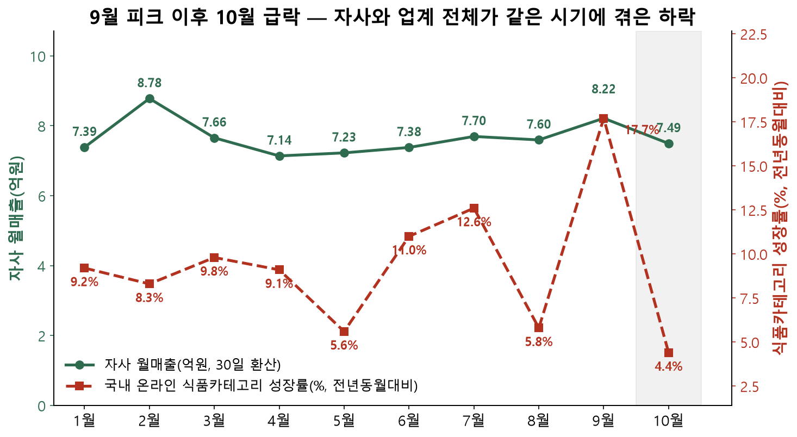
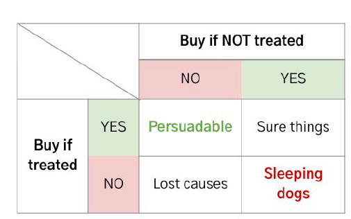
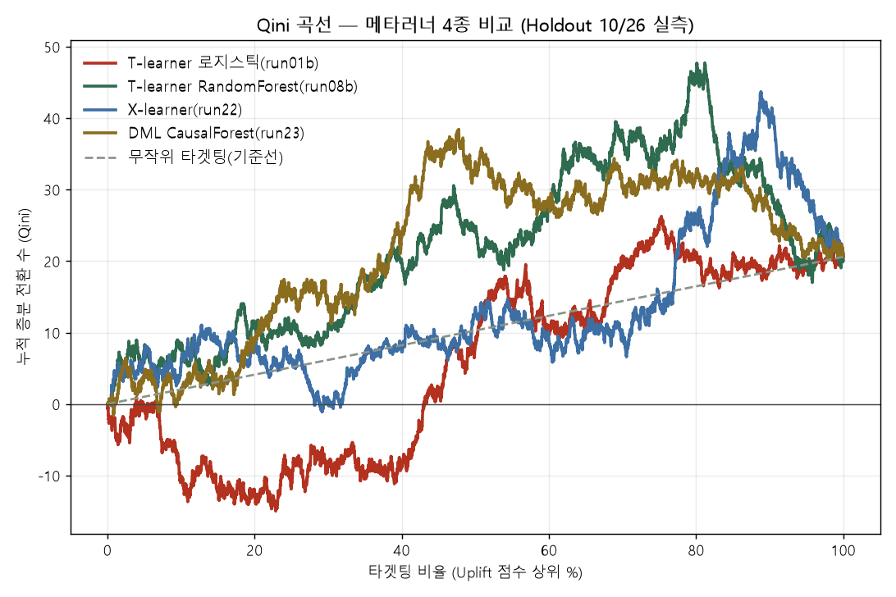
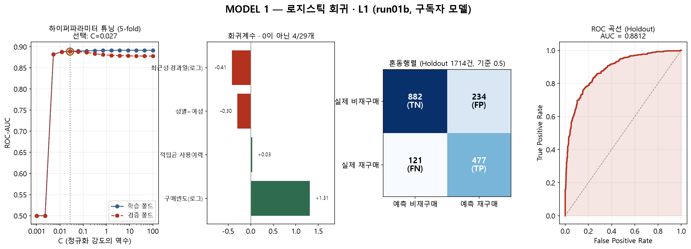
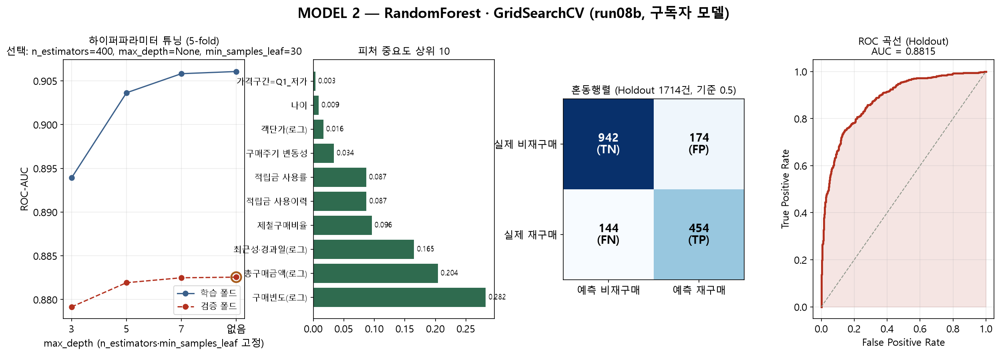

# 기술 상세 문서 — E-Commerce Uplift Analysis

> 이 문서는 [메인 README](../README.md)에서 발표 흐름에 맞춰 요약한 내용의 **전체 근거**입니다.
> 전처리 규격, 메타러너 3계열(T·X·DML) 비교, Qini/AUUC·부트스트랩 CI·순위상관 검증, ROI 시뮬레이션,
> 그리고 **어떤 결론이 어디까지 데이터로 뒷받침되는지의 경계**까지 전부 담고 있습니다.
>
> 📊 발표 자료: [`presentation/B1조_빅데이터_이커머스_최종발표.pdf`](../presentation/B1조_빅데이터_이커머스_최종발표.pdf)


-2f6b4f)

---

## 📌 1. 한눈에 보기 (TL;DR)

| 항목 | 내용 |
|---|---|
| **비즈니스 문제** | 월매출 15억 → 10억대 급락. 무차별 프로모션의 ROI가 검증된 적 없음 |
| **분석 질문** | "프로모션(멤버십 구독 유도)이 **실제로 구매를 만들어내는 고객**은 누구인가?" |
| **핵심 기법** | Uplift Modeling — T-learner(로지스틱 L1 / RandomForest), X-learner, DML(CausalForestDML) |
| **평가 지표** | Qini 곡선·AUUC, 부트스트랩 95% CI, 메타러너 간 Spearman 순위상관·Top-20% Jaccard, arm별 Holdout AUC |
| **최종 산출물** | 개인별 Uplift 점수 + **3단계 타겟팅 리스트(Tier1 418명 / Tier2 95명 / Tier3 1,958명)**, FastAPI+Streamlit 대시보드 |
| **데이터 규모** | 거래 668,111행 · 회원 12,540명 · 상품 2,549종 + 외부 거시·기상 변수 13종 |

### 정량 성과 (Holdout 10/26 실측 기반 시뮬레이션 · `src/run25_targeting_roi.py`)

| 전략 | 접촉 인원 | 1인당 기대 Uplift | 기대 ROI | 손익분기 접촉단가 |
|---|---:|---:|---:|---:|
| ① 전체 비구독자 무차별 발송 *(현행)* | 8,276명 | 0.68–1.55%p | **0.2–0.4배** | 506–1,158원 |
| ② 무작위 418명 *(대조군)* | 418명 | 0.67–1.55%p | 0.2–0.4배 | 502–1,158원 |
| ③ **Tier1 최우선 418명 (본 프로젝트 산출물)** | **418명** | **4.78–7.58%p** | **1.2–1.9배** | **3,576–5,678원** |

> 접촉 단가 3,000원/인, 증분 전환 1건당 기대매출 74,887원(Holdout 재구매 고객의 14일 실측 평균) 가정.
> **같은 예산 제약에서 흑자가 나는 유일한 시나리오가 ③**이며, 무차별 발송은 접촉 단가가 1,158원을 넘는 순간 손실 구간에 들어갑니다.
> 추가로 접촉비용 **23,574,000원 절감**, 매출 리스크군(Tier2) 제외로 기대 매출 훼손 **1,035,869원 회피**.

---

## 🎯 2. 배경 & 비즈니스 문제 정의

### 2-1. 상황

친환경 신선식품 이커머스 기업(가명: *이커머스데이터*)은 2024년 분기 성장률 13→15→25→27%로 정점을 찍은 직후, 금리 인상·식자재가 급등과 함께 월매출이 15억 원대에서 10억 원대로 내려앉았습니다. 사내 데이터마케팅(DM)팀 관점에서 착수한 분석 프로젝트입니다.

실측 데이터 기준 월매출은 9월 → 10월에 **-8.8%** 감소했지만, 같은 기간 국내 온라인쇼핑 음식료품 카테고리 전체가 **-15.9%** 위축(국가데이터처)됐습니다. **자사만의 고립된 위기가 아니라 시장 전체의 하강 국면**이라는 것 — 즉 지금이 남들보다 먼저 체질을 개선할 시점이라는 것이 프로젝트의 출발점입니다.



### 2-2. 왜 반응 예측(Response Model)이 아니라 Uplift Modeling인가

일반적인 반응 예측 모델은 `P(구매 | 프로모션 O)`가 높은 고객을 고릅니다. 그런데 이 점수가 높은 고객은 대부분 **프로모션이 없어도 어차피 살 사람(Sure Thing)** 입니다. 즉 반응 예측 모델을 그대로 타겟팅에 쓰면, 이미 확보된 매출에 쿠폰을 얹어주는 **예산 낭비를 정확하게 최적화**하게 됩니다.

필요한 것은 확률이 아니라 **차이(개인별 처치효과, ITE)** 입니다.

```
Uplift(고객 X) = P(구매 | X, 프로모션 O) − P(구매 | X, 프로모션 ✗)
                 └──── 관측 가능 ────┘   └── 반사실(counterfactual), 관측 불가 ──┘
```



| 세그먼트 | 처치 시 구매 | 미처치 시 구매 | Uplift | 마케팅 관점 | 이 프로젝트의 대응 |
|---|:---:|:---:|:---:|---|---|
| 🟢 **Persuadable** | YES | NO | **(+)** | 타겟 1순위 — 프로모션이 구매를 *만들어냄* | Tier1로 분류, 예산 집중 |
| 🟡 Sure Thing | YES | YES | 0 | 어차피 구매 — **예산 낭비** | 상위 랭킹에서 배제 |
| ⚪ Lost Cause | NO | NO | 0 | 무슨 수를 써도 반응 없음 | 접촉 제외 |
| 🔴 **Sleeping Dog** | NO | YES | **(−)** | 프로모션이 구매를 *막음* — 역효과 | 음수 Uplift·매출 리스크 필터로 제외 |

### 2-3. 데이터 제약과 설계 판단 ⚠️

원본 데이터에는 **쿠폰·프로모션 노출 이력(Treatment) 컬럼이 존재하지 않습니다.** 이 제약을 우회하기 위해 Treatment를 재정의했고, 그 선택이 결론에 미치는 영향을 마지막까지 추적해 문서에 남겼습니다.

| 설계 요소 | 정의 | 판단 근거 |
|---|---|---|
| **Treatment (T)** | 멤버십(정기배송) 구독 여부 | 프로모션 노출 컬럼 부재. 대안이던 적립금 사용여부는 **자기선택편향**이 극심해 배제(적립금 사용 고객 평균 주문 25.9회 vs 미사용 3.9회, 7배 격차) |
| **Outcome (Y)** | 기준일 이후 **14일 내 재구매 여부** | 재구매 간격 분포에서 누적 80.1% 포착. 30일 기준은 양성률 88%로 ceiling effect가 발생해 세그먼트 차이가 소멸 |
| **분석 단위** | `회원번호 × index_date` 스냅샷 | 원본 1행은 "주문"이 아니라 "품목"(주문당 평균 3.34개) → 다품목·고빈도 고객 과대대표 방지 |
| **분할** | Train `index_date=9/16` / Holdout `index_date=10/26` | 랜덤 분할이 아닌 **시간 기준 분할**로 미래 정보 누수 차단 |

> 📎 Treatment가 무작위 배정이 아닌 **관측된 자기선택**이라는 점이 이 프로젝트의 가장 큰 방법론적 리스크입니다. 이를 경고 문구로 남기는 데 그치지 않고 **Double ML로 직접 스트레스 테스트한 결과**가 [4-5절](#4-5-방법론-검증-노트--dml까지-돌려본-이유)입니다.

---

## 🏗️ 3. 파이프라인 & 방법론


### 3-1. 데이터 전처리 & 피처 엔지니어링

8-Step 공통 파이프라인(`src/preprocess_pipeline.py`)으로 **4개 분석 파트가 동일한 스냅샷·동일한 Y·동일한 이상치 기준**을 공유하도록 설계했습니다. 각자 전처리를 하면 파트 간 결과를 비교할 수 없기 때문입니다.

| Step | 처리 | 주요 산출 |
|---|---|---|
| 0 | 무결성 검증 | 고아 레코드·중복 PK **0건** 확인, cp949 인코딩 처리 |
| 1 | 컬럼 정제 | 주소지 축약형 정규화(983건), 주문시간 포맷 오류 보정 |
| 2 | **파생변수 생성** | `basket_amt`(장바구니 재집계), `log_basket_amt`(왜도 27.4 → 0.43), `가격구간`(AOV 4분위), RFM(`frequency`/`monetary`/`recency_days`/`regularity_cv`), `제철여부`·`계절성지수`, `region_tier`, `age_gender_segment`, `treatment_h4`, `y_repurchase_14d` |
| 3 | 이상치 **플래그**(삭제 아님) | `abnormal_account_flag`(주문 500건 초과 또는 상위 1%) — 4개 파트가 공통 참조 |
| 4 | 결측 처리 | 결혼 21.7% 대치 금지, 구독여부 결측 18.7%는 행동 기반 재분류를 시도했으나 **분류 성능이 랜덤 수준이라 unresolved로 격리**(억지 대치 대신 분석 제외) |
| 5 | 인코딩·스케일링 | OneHot + StandardScaler, 소표본 지역 스무딩 |
| 6 | Train/Holdout 시간분할 | 라벨 관측 가능성(N=14일)을 고려한 cutoff 적용 |
| 7 | 최종 검증 | 기존 브리핑 수치 재현 `assert` |

**데이터 정합성 관리 — 파이프라인이 잡아낸 3건**

1. **품목행 ≠ 주문**: 668,111 품목행 = 실제 191,018 주문(주문당 3.34품목). 두 명의 팀원이 서로 다른 코드로 재집계해 **191,018건으로 정확히 일치**하는 것을 교차검증했습니다.
2. **원본 데이터 자체의 결측 8일**(10/3, 10/11–12, 11/10–14). 이 중 **11/10–14 닷새가 최초 Holdout(11/2 기준)의 라벨 관측창 한가운데와 겹쳐** 재구매율이 과소추정되고 있었습니다 → **Holdout 기준일을 10/26으로 재설정하고 영향받는 모델을 전부 재실행**(재구매율 26.9% → 34.3%로 정정, Uplift 추정치 자체는 안정적으로 재현).
3. **완전 다중공선성**: `monetary = frequency × aov` 항등식 때문에 `log_monetary`가 `log_frequency`+`log_aov`에 완전 종속 → `log_aov` 제거 후 재실행.

### 3-2. 모델링 전략 — 메타러너 3계열 교차검증

| 메타러너 | 구현 | 채택 | 판단 근거 |
|---|---|:---:|---|
| **S-learner** | Treatment를 피처 하나로 투입 | ❌ | Treatment 신호가 약하면 모델이 T를 사실상 무시해 **Sure Thing만 골라내는 함정**. 본 데이터는 처치군 학습표본이 1,626명뿐이라 이 위험이 큼 |
| **T-learner** | 구독자/비구독자 arm별 독립 모델 → 예측차 | ✅ **메인** | `run01b` 로지스틱(L1 자동 피처선택) + `run08b` RandomForest(GridSearchCV) 2종. arm별 Holdout AUC 0.869–0.883 |
| **X-learner** | ITE 대체(impute) 후 성향점수 가중 | ✅ 교차검증 | 대조군 8,276명 ≫ 처치군 3,456명의 **불균형 구조에서 이론적으로 유리**(`run22`) |
| **DML (CausalForestDML)** | 결과·처치 모델 잔차 직교화 | ✅ 스트레스 테스트 | 관측 데이터의 confounding을 **명시적으로** 통제(`run23`) |

**모델링 과정에서 확인한 것 — "AUC 올리기"와 "Uplift 안정화"는 다른 문제**

- 피처를 늘리면 각 arm의 AUC는 그대로거나 오히려 하락하는데 **Uplift 추정 노이즈는 2–2.5배로 증가**했습니다(처치군 표본 과소로 인한 과적합). → 수동 피처 선별 대신 **L1 자동선택**을 채택(29개 인코딩 피처 중 4개 생존: `log_frequency`·`log_recency`·`log_monetary`·`성별`/적립금 이력 계열).
- RandomForest를 GridSearchCV로 정식 재튜닝해 arm AUC를 올려도(0.883/0.869) **Uplift 추정치의 표준편차(4.44%p)는 줄지 않았습니다.** 개별 arm의 예측 정확도 향상이 두 예측의 *차이*의 안정성까지 보장하지는 않는다는 것을 실증한 사례입니다.

### 3-3. 평가 지표 — 인과추론 특화 지표 적용

정확도(AUC)는 "구매할 사람"을 맞히는 지표일 뿐, "프로모션으로 마음이 바뀔 사람"의 랭킹 품질을 말해주지 않습니다. 그래서 아래 4개 축으로 평가했습니다.

**① Qini 곡선 & AUUC** (`src/run24_qini_auuc.py`) — Holdout 9,990명(처치군 1,714 / 대조군 8,276) 실측



| 모델 | Qini 계수 | 부트스트랩 95% CI | AUUC | 상위 20% 증분전환 | 상위 20% 포착률 |
|---|---:|---|---:|---:|---:|
| T-learner 로지스틱 (run01b) | **-4.66** | [-15.94, 5.81] | 5.63 | -12.3명 | 무작위 이하 |
| T-learner RandomForest (run08b) | **+11.29** | [-1.34, 24.10] | 21.59 | +11.3명 | **54.9%** |
| X-learner (run22) | +2.78 | [-10.62, 15.73] | 13.08 | +8.1명 | 39.5% |
| DML CausalForest (run23) | **+11.29** | **[0.16, 23.65]** | 21.59 | +8.8명 | 42.6% |

*Qini(k) = Y_t(k) − Y_c(k)·N_t(k)/N_c(k) — 상위 k명을 타겟팅했을 때 대조군 대비 추가로 얻는 누적 전환수. 전체 증분전환은 20.6명. RF와 DML의 AUUC가 같아 보이는 것은 반올림 결과이고(21.587 vs 21.589) 곡선 형태는 서로 다릅니다.*

**이 표에서 읽어야 할 것 세 가지**

1. **트리 계열(RF·DML)은 상위 20% 안에 전체 증분 전환의 42–55%를 담아냅니다**(무작위라면 20%). 상위 20%만 접촉해도 증분의 절반 가까이를 회수한다는 뜻이며, 4-1절 ROI 시뮬레이션의 근거가 됩니다.
2. **로지스틱 단독 랭킹은 Qini 기준 무작위 이하입니다.** 로지스틱을 단독 타겟팅 근거로 쓰지 않고 **두 모델이 동시에 지목한 교집합만 신뢰하는 이중검증 설계**([4-2절](#4-2-최종-타겟팅-리스트--tier-13))로 간 것이 이 관측과 정합합니다.
3. **모든 CI가 넓고 대부분 0을 포함합니다.** 처치군 1,714명·전체 증분 전환 20.6명이라는 표본에서 Qini는 애초에 통계적 파워가 부족합니다. 또한 Qini/AUUC는 원래 **RCT를 전제한 지표**이므로, 여기서의 값은 "실험으로 보증된 증분"이 아니라 **모델 간 랭킹 품질의 상대 비교치**로만 해석합니다. 이 지표를 계산한 목적도 순위를 매기기 위해서가 아니라, 어떤 결론까지 데이터가 지지하는지 경계를 긋기 위해서입니다.

**② 부트스트랩 신뢰구간** — 평균 Uplift를 점추정치가 아니라 구간으로 보고(T-learner +0.68%p [0.62, 0.73] / +1.55%p [1.45, 1.64], X-learner +1.47%p [1.36, 1.58]).

**③ 메타러너 간 합의도 (Spearman 순위상관 · Top-20% Jaccard)** — 단일 모델에서만 나온 우연을 배제하기 위한 재현성 검증.

| 비교 | 순위상관 | 상위 20% 겹침(무작위 대비) |
|---|---:|---:|
| T-learner(RF) ↔ X-learner | **0.80** | 3.34배 |
| T-learner(RF) ↔ DML | 0.25 | 1.92배 |
| T-learner 로지스틱 ↔ RandomForest *(같은 담당자, 다른 모델 클래스)* | **0.089** | 1.6배 |
| **T · X · DML 3종 만장일치 상위 20%** | — | **7.3배** (482명) |

> 💡 **팀 전체 8개 모델을 비교해 얻은 발견**: 개인별 Uplift 순위는 "어떤 가설을 담당했는가"(가격/연령성별/계절/지역)보다 **"로지스틱이냐 RandomForest냐"에 훨씬 더 크게 좌우**됩니다(RF끼리 0.82–0.86 vs 같은 사람의 로지스틱↔RF 0.06–0.09). 이 발견이 최종 타겟팅 로직을 "단일 최고 모델 선택"이 아니라 **"모델 클래스가 다른 두 모델의 교집합"** 으로 설계한 직접적인 근거입니다.

**④ arm별 Holdout AUC** — T-learner를 구성하는 개별 모델의 건전성 확인(0.869–0.883). 하이퍼파라미터 튜닝·회귀계수/피처중요도·혼동행렬·ROC를 함께 점검했습니다.





---

## 💰 4. 핵심 결과 & 비즈니스 임팩트

### 4-1. ROI 시뮬레이션 — 예산 효율 개선

`src/run25_targeting_roi.py` · 가정: 접촉 단가 3,000원/인, 증분 전환 1건당 기대매출 74,887원(Holdout 실측), 기대 증분 전환수 = 그룹 내 개인별 ITE 추정치의 합(로지스틱–RF 두 모델로 범위 산출)

| 전략 | 접촉 인원 | 접촉 비용 | 기대 증분전환 | 1인당 증분전환율 | **ROI** | 손익분기 단가 |
|---|---:|---:|---:|---:|---:|---:|
| ① 전체 무차별 발송(현행) | 8,276명 | 24,828,000원 | 56.0–128.0명 | 0.68–1.55%p | 0.2–0.4배 | 506–1,158원 |
| ② 무작위 418명 | 418명 | 1,254,000원 | 2.8–6.5명 | 0.67–1.55%p | 0.2–0.4배 | 502–1,158원 |
| ③ **Tier1 418명** | **418명** | **1,254,000원** | **20.0–31.7명** | **4.78–7.58%p** | **1.2–1.9배** | **3,576–5,678원** |
| ④ Tier1+Tier3 2,376명 | 2,376명 | 7,128,000원 | 68.5–89.9명 | 2.88–3.78%p | 0.7–0.9배 | 2,158–2,834원 |

- **타깃 효율 4.9–7.1배**: Tier1의 1인당 기대 Uplift(4.78–7.58%p)는 무차별 발송 평균(0.68–1.55%p)의 4.9–7.1배입니다. 동일 인원의 무작위 추출(2,000회 평균)과 비교해도 같은 배수가 재현돼, 우연으로는 설명되지 않습니다.
- **접촉 비용 94.9% 절감**: 8,276명 → 418명. 3,000원 단가 기준 **23,574,000원 절감**하면서 기대 증분 전환은 무차별 발송의 25–36% 수준을 유지합니다(*비용은 1/20, 성과는 1/3–1/4*).
- **손익분기 관점의 결론**: 무차별 발송은 접촉 단가가 **1,158원**만 넘어도 적자입니다. 실제 구독 유도 쿠폰 단가가 그보다 높다는 점을 감안하면 **현행 방식은 구조적으로 손실**이며, Tier1 타겟팅(손익분기 3,576–5,678원)만이 흑자 구간에 들어옵니다.
- **어디서 멈출지도 데이터로**: ④처럼 Tier3까지 확장하면 ROI가 1.0 밑으로 떨어집니다. "더 많이 보내라"가 아니라 **"여기서 멈춰라"를 수치로 제시한 것**이 이 리스트의 실질적 가치입니다.

### 4-2. 최종 타겟팅 리스트 — Tier 1–3

모델 클래스가 서로 다른 두 모델(`run01b` 로지스틱 ∩ `run08b` RandomForest)이 **동시에 상위 20%로 지목한 고객(이중검증)** 에 **매출 리스크 필터**(고가군 Q4는 매출 Uplift가 음수)를 교차해 3단계로 산출했습니다. 타겟 후보(비구독자) 8,276명 기준 — `src/run11_final_targeting_list.py`

| Tier | 인원 | 정의 | 1인당 기대 매출 Uplift | 권장 액션 |
|---|---:|---|---:|---|
| 🥇 **Tier1_최우선** | **418명** | 이중검증 통과 + 매출 리스크 없음 | **+7,242원** | 구독 프로모션 즉시 집행 |
| ⚠️ **Tier2_매출리스크주의** | **95명** | 이중검증 통과 + 고가군(Q4) | **-10,904원** | **구독 유도 금지.** 대량구매 혜택·VIP 등급 등 다른 오퍼로 전환 |
| 🥈 Tier3_보조신호 | 1,958명 | 로지스틱·RF 중 한 모델만 상위 20% | +2,889원 | 예산 여유 시 2순위(단독 집행 시 ROI 1.0 미만) |

- 이중검증을 통과한 513명(Tier1+2)은 두 모델이 우연히 겹칠 기대치(331명)의 **1.6배**입니다.
- **Tier2의 존재가 이 리스트의 핵심 차별점**입니다. 재구매 확률만 보면 Tier1과 똑같이 매력적인 95명이지만, 매출 관점에서는 1인당 -10,904원의 손실 구간입니다. 이들을 걸러내 **약 104만 원의 기대 매출 훼손을 회피**합니다. 반응 예측 모델이었다면 이 95명은 최우선 타겟으로 분류됐을 것입니다.
- 원자료: [`data/run11_final_targeting_list.csv`](../data/run11_final_targeting_list.csv)

### 4-3. 반전 인사이트 — "구독은 재구매를 늘리지만 객단가를 줄인다"

Y를 **재구매 확률**에서 **14일 매출액**으로 바꿔 다시 추정하자 부호가 뒤집혔습니다(`run06`).

| 기준 | 선형 모델(로지스틱/ElasticNet) | RandomForest | 방향 |
|---|---:|---:|:---:|
| 재구매 **확률** Uplift | +0.68%p [0.62, 0.73] | +1.55%p [1.45, 1.64] | 🔼 양수·유의 |
| 재구매 **매출** Uplift | -934원 [-1157, -717] | -621원 [-1258, 3] | 🔽 음수·유의 |
| └ 고가군(Q4)만 | **-5,360 – -5,732원** | **-5,360 – -5,732원** | 🔽 두 모델 방향 일치 |

정기배송 전환이 **"크고 드문 구매"를 "작고 잦은 구매"로 대체**하면서, 재구매 횟수는 늘어도 순매출은 깎일 수 있다는 해석입니다. 전환율 단일 KPI로 캠페인을 운영했다면 **성공으로 집계되면서 실제 매출은 감소하는** 상황이 발생할 수 있었습니다. 이 발견이 Tier2 필터의 근거이며, 이 프로젝트에서 실무적 가치가 가장 큰 결과입니다.

### 4-4. 가설 검증 (H1–H4) & 부수 성과

| 가설 | 담당 | 판정 | 근거 |
|---|:---:|:---:|---|
| **H1** 가격 민감도(구매금액 구간)별 반응 차이 | A | **부분 지지** | 평균 효과는 유의하나 1위 구간이 로지스틱 Q3 ↔ RF Q4로 불일치(재튜닝해도 유지 → 모델 클래스 차이) |
| **H2** 지역×배송조건 | D | **기각** | 교호항 Train p=0.624. 지역별 리드타임 차이가 최대 0.05일에 불과 |
| **H3** 계절성 상품 반응 | C | **기각** | 11개월 중 8월만 유의하고 방향도 가설과 반대(-6.5%) |
| **H4** 연령×성별(30대 여성 최대 예상) | B | **기각** | LR test p=0.65(Train)/0.32(Holdout), 30s_F는 오히려 하위권 |

> **4개 가설이 모두 무너진 것이 오히려 최종 전략의 근거가 됐습니다.** 인구통계·지역·계절 같은 **사전 정의 세그먼트로는 처치효과의 이질성을 설명할 수 없다**는 것이 다중 모델·통제변수 확장으로 반복 검증됐고, 그래서 "세그먼트를 나눠 다르게 대우하라"가 아니라 **"개인별 Uplift 점수로 순위를 매겨라"** 가 데이터로 뒷받침되는 유일한 결론이 됩니다.

**부수 성과 — 기존 위기 서사 수치의 정정**: 사내에서 통용되던 "추석 직후 매출 -63.8%"는 **요일효과가 통제되지 않은 원시 비교**였습니다. 실제 공휴일 캘린더 기준으로 요일을 매칭해 재검증한 결과 **-28.5%(대응표본 t검정 p=0.012)** 이며, 낙폭이 **주말에 집중**(토 -54.4%, 일 -58.2% vs 평일 -4 – -26%)됩니다. → 명절 프로모션 예산을 연휴 전체가 아니라 **연휴 내 주말 구간에 집중 배정**하라는 실행 권고로 이어졌습니다.

**추가 분석**: VIP 전환 예측 모델(Test AUC 로지스틱 0.854 / RF 0.881, `run13`), 신선식품×배송지역 카이제곱(p=0.030으로 유의하지만 **Cramer's V=0.0033** → "통계적 유의 ≠ 실무적 의미"의 교과서적 사례, `run12`), RFM 세그먼트·코호트 리텐션·연관규칙·결제수단·지역매출(`run14`–`run19`).

### 4-5. 방법론 검증 노트 — DML까지 돌려본 이유

T/X-learner는 결과 모델만 사용할 뿐, "누가 스스로 구독을 선택했는가"의 불확실성(성향점수)은 반영하지 않습니다. 관측 데이터에서 이 차이가 실제로 결론을 가르는지 확인하기 위해 EconML `CausalForestDML`로 재검증했습니다(`run23`).

| 지표 | T-learner (run08b) | X-learner (run22) | **DML (run23)** |
|---|---:|---:|---:|
| 평균 Uplift | +1.55%p | +1.47%p | +0.86%p |
| 95% CI | [1.45, 1.64] *(부트스트랩)* | [1.36, 1.58] *(부트스트랩)* | **[-4.37, 6.10]** *(점근적 CI, **0 포함**)* |
| T-learner와 순위상관 | — | 0.80 | 0.25 |
| 상위 20% 겹침(무작위 대비) | — | 3.34배 | 1.92배 |

**해석**: 성향점수 추정의 불확실성까지 반영하면 **"구독이 평균적으로 재구매를 유의하게 늘린다"고 단정하기 어렵습니다.** T/X-learner의 좁은 CI는 개인별 예측값 평균의 표본변동만 반영한 것이라 과신(overconfident)이었을 가능성이 있습니다.

**동시에, 타겟팅 전략의 전제는 세 메타러너 모두에서 살아남았습니다**: 상위 20% 겹침이 무작위 대비 1.9–3.3배, 3종 만장일치 그룹은 482명으로 무작위 기대치의 **7.3배**입니다. 즉 *"고객마다 반응이 다르고 그중 일부는 뚜렷하게 반응한다"* 는 명제는 일관되게 재현됩니다. 최종 타겟팅(Tier1–3)은 애초에 **평균 효과가 아니라 개인별 순위**에 기반하므로 이 결론에 좌우되지 않으며, 발표·보고서에서는 평균 효과를 단정하는 대신 **"T/X-learner 기준으로는 유의했으나, selection bias를 명시적으로 통제하는 DML로는 확정하기 어렵다"** 는 표현을 사용합니다.

> 📌 이 절은 프로젝트에서 **가장 공들인 부분**입니다. 좋아 보이는 숫자를 지키는 대신 그 숫자가 어디까지 견디는지 스스로 검증하고, 살아남은 결론과 그렇지 않은 결론을 구분해 문서에 남기는 것이 실무에서 신뢰할 수 있는 분석이라고 판단했습니다.

---

## 📁 5. 프로젝트 구조

```
E_Commerce_Uplift_Analysis/
├── src/                              # 전처리·모델링·평가 파이프라인 (실행 순서대로 번호 부여)
│   ├── merge_and_enrich.py               # ① 원본 3테이블 병합 + 외부변수 13종 결합
│   ├── preprocess_pipeline.py            # ② 8-Step 전처리·파생변수·Train/Holdout 시간분할
│   ├── run01b_kitchen_sink_l1.py         # ③ T-learner 로지스틱(L1 자동 피처선택)  ★대표모델
│   ├── run08b_uplift_forest_gridsearch.py# ③ T-learner RandomForest(GridSearchCV)  ★대표모델
│   ├── run22_xlearner.py                 # ④ X-learner 교차검증
│   ├── run23_dml_causalforest.py         # ④ DML(CausalForestDML) 스트레스 테스트
│   ├── run24_qini_auuc.py                # ⑤ Qini/AUUC + 부트스트랩 CI + Qini 곡선 생성
│   ├── run11_final_targeting_list.py     # ⑥ 이중검증 + 매출리스크 필터 → Tier1–3 산출
│   ├── run25_targeting_roi.py            # ⑦ 타겟팅 전략별 ROI 시뮬레이션
│   ├── run06 / run07                     # 매출 Uplift · 이탈위험군 Uplift
│   ├── run09 / run10                     # 4파트 백테스팅 · 전체 모델 리더보드
│   └── run12–run19                       # 카이제곱·VIP전환예측·연관규칙·RFM·코호트·지역매출 등 보조 분석
├── data/                             # 스냅샷·모델 출력 CSV + 원본/병합 데이터(zip)
│   ├── snapshot_train.csv / snapshot_holdout.csv  # 실제 학습·검증에 쓰인 스냅샷
│   ├── run11_final_targeting_list.csv             # ★ 최종 산출물 (Tier1–3)
│   ├── run24_qini_auuc_summary.csv / run25_roi_simulation.csv
│   └── raw_and_merged_data.zip                    # 원본 약 370MB → 48MB 압축
├── presentation/                     # 최종 발표 자료
│   ├── B1조_빅데이터_이커머스_최종발표.pdf     # ★ 발표 덱 (19장, PDF)
│   └── slides/                           # 슬라이드 낱장 이미지(PNG)
├── docs/                             # 기술 상세 문서·PRD·EDA 인사이트·리더보드
│   ├── 기술_상세_문서.md                  # ★ 이 문서 (방법론·검증 전문)
│   ├── PRD.md                            # 프로젝트 정의서(배경·설계·결과·한계 총괄)
│   ├── 모델링_통합결과_H1_H4.md           # 가장 상세한 방법론·수치 근거
│   ├── 리더보드_run10.md                  # 전체 모델 리더보드 + 교차검증 요약
│   └── 전처리_통합_인사이트_ABCD.md        # 4파트 EDA 취합 → 공통 전처리 설계 합의문
├── notebooks/                        # 제출용 Jupyter Notebook(실행결과 포함)
├── reports/                          # 발표 리포트·정적 대시보드(HTML/PDF)
├── dashboard/                        # FastAPI + Streamlit 인터랙티브 대시보드
├── assets/                           # README 시각자료(Qini 곡선·모델 진단·EDA 차트)
└── requirements.txt
```

---

## 👥 6. 팀 & 협업 구조

5인 팀이 **가설별로 모듈을 나눠 병렬 분석하고 하나의 공통 파이프라인으로 통합**하는 방식으로 진행했습니다. 각자 전처리를 하면 결과를 비교할 수 없기 때문에, **분석 착수 전에 4파트의 EDA 결과를 취합해 전처리 규격을 먼저 합의**([`docs/전처리_통합_인사이트_ABCD.md`](전처리_통합_인사이트_ABCD.md))한 것이 이 프로젝트 협업의 핵심입니다.

| 파트 | 담당 모듈 | 가설 | 주요 기여 |
|:---:|---|:---:|---|
| **A** | 가격·구매금액 / **모델링 파이프라인 통합** | H1 | 8-Step 전처리 파이프라인 구현, T/X-learner·DML 구축, Qini·ROI 평가 체계, 최종 Tier 리스트 산출, 대시보드 |
| **B** | 연령×성별 세그먼트 | H4 | 분석 단위(`회원번호×index_date`) 설계 제안, Y 기준 14일 확정(30일 ceiling effect 발견), 표본 불균형 경고 |
| **C** | 계절·명절 상품 | H3 | `제철여부` 파생 설계, **11/10–14 원본 결측 발견**(Holdout 재설정의 계기), **"-63.8%" 위기서사 수치 정정** |
| **D** | 지역×배송조건 | H2 | 주소지 정규화·`region_key` 설계, 리드타임 기반 배송권역 구분 불가 실증, 지역별 구독률 2.5배 격차 발견 |

**통합 규격 (4파트 공통 준수)**

- 동일 스냅샷(`snapshot_train/holdout.csv`) · 동일 Y(`y_repurchase_14d`) · 동일 Treatment(`treatment_h4`) · 동일 필터(`include_in_uplift_model==1`)
- 이상거래계정 플래그는 **Step3에서 한 번만 생성**해 4파트가 공유(각자 만들면 기준이 달라져 정합성이 깨짐)
- 4개 파트가 제출한 CSV의 `treatment_h4` 값이 완전히 일치하는지 `run09`에서 교차 검증

**협업 과정에서의 판단**: 프로젝트 후반 Holdout 재설정 이후 B/C/D의 재계산 결과 회신이 지연되어, 동일 방법론으로 보완 산출한 값으로 4파트 "만장일치" 지표를 만들었습니다. 그러나 4개 결과가 사실상 같은 방법론의 변형이라 **만장일치 인원이 인위적으로 부풀려지는 것**(실측 161–454명 → 보완 산출 898–910명)을 확인하고 **해당 지표를 최종 근거에서 제외**했습니다. 최종 타겟팅은 100% 실측 기반인 A의 두 모델 이중검증으로 대체했으며, 그 결과 발표 자료의 모든 수치를 캐비엇 없이 인용할 수 있게 됐습니다.

---

## 🚀 7. 재현 방법 (Getting Started)

### 7-1. 환경 세팅

```bash
git clone https://github.com/YangNaang2/E_Commerce_Uplift_Analysis.git
cd E_Commerce_Uplift_Analysis

python -m venv .venv
source .venv/bin/activate      # Windows: .venv\Scripts\activate
pip install -r requirements.txt
```

> Python 3.10+ 권장(개발·검증 환경은 3.13.3). `econml`은 `run23`(DML) 전용이라, 설치가 어려우면 해당 스크립트만 건너뛰어도 나머지는 그대로 동작합니다.

### 7-2. 평가 지표·ROI 재현 — **클론 직후 바로 실행 가능** ✅

리포지토리의 `data/`에 스냅샷과 모델 출력 CSV가 포함돼 있어, 아래 두 스크립트는 **원본 데이터 없이도 3-3절·4-1절의 모든 수치를 그대로 재현**합니다(상대 경로 기반).

```bash
python src/run24_qini_auuc.py      # Qini/AUUC + 부트스트랩 CI → data/run24_qini_auuc_summary.csv, assets/qini_curve.png
python src/run25_targeting_roi.py  # 전략별 ROI 시뮬레이션      → data/run25_roi_simulation.csv
```

### 7-3. 전체 파이프라인 재실행 (원본 데이터 필요)

```bash
# 1) 원본·병합 데이터 압축 해제 (원본 약 370MB → 48MB로 압축돼 있음)
unzip data/raw_and_merged_data.zip -d data/    # data/raw/, data/processed/ 생성

# 2) 병합 → 전처리 → 모델링 → 타겟팅 순서로 실행
python src/merge_and_enrich.py                 # 3테이블 병합 + 외부변수 결합
python src/preprocess_pipeline.py              # 8-Step 전처리 + Train/Holdout 스냅샷 생성
python src/run01b_kitchen_sink_l1.py           # T-learner 로지스틱(L1)
python src/run08b_uplift_forest_gridsearch.py  # T-learner RandomForest
python src/run06_revenue_uplift.py             # 매출 Uplift (Tier2 필터의 근거)
python src/run22_xlearner.py                   # X-learner 교차검증
python src/run23_dml_causalforest.py           # DML 재검증
python src/run11_final_targeting_list.py       # 최종 타겟팅 리스트 산출
```

> ⚠️ `run01`–`run23`은 개발 당시 데이터 경로를 파일 상단의 `BASE` 상수(절대 경로)로 두고 있습니다. 다른 환경에서 실행하려면 **그 한 줄만 자신의 `data/processed` 경로로 수정**하면 됩니다. `run24`·`run25`는 리포지토리 상대 경로로 작성돼 수정이 필요 없습니다.

### 7-4. 대시보드 실행

```bash
pip install -r dashboard/requirements.txt
python dashboard/backend/main.py          # http://localhost:8000  (FastAPI)
streamlit run dashboard/frontend/app.py   # http://localhost:8501  (Streamlit)
```

KPI / 프로모션 타겟팅 / 구독자 관리 / 매출 리포트 / 고객 CSV 분석 5개 탭과 매출 시뮬레이터를 제공합니다.
서버 없이 결과만 확인하려면 [`reports/대시보드_통합본.html`](../reports/대시보드_통합본.html)을 더블클릭해 열면 됩니다.

### 7-5. 더 자세한 근거를 보려면

| 문서 | 내용 |
|---|---|
| [`docs/PRD.md`](PRD.md) | 프로젝트 정의서 — 배경·KPI·데이터·설계·결과·한계 총괄 |
| [`docs/모델링_통합결과_H1_H4.md`](모델링_통합결과_H1_H4.md) | 가장 상세한 방법론·수치 근거(가설별 검증 전문) |
| [`docs/리더보드_run10.md`](리더보드_run10.md) | 전체 모델 리더보드 · 이중검증 · X-learner/DML 교차검증 |
| [`notebooks/A파트_Uplift모델링_노트북.ipynb`](../notebooks/A파트_Uplift모델링_노트북.ipynb) | 전처리–최종 타겟팅 전 과정의 실행결과 포함 노트북 |

---

## 📚 참고 문헌

- Künzel, S. R., Sekhon, J. S., Bickel, P. J., & Yu, B. (2019). *Metalearners for estimating heterogeneous treatment effects using machine learning.* PNAS, 116(10). — X-learner 구현 근거
- Chernozhukov, V., et al. (2018). *Double/Debiased Machine Learning for Treatment and Structural Parameters.* The Econometrics Journal, 21(1). — DML 이론
- Wager, S., & Athey, S. (2018). *Estimation and Inference of Heterogeneous Treatment Effects using Random Forests.* JASA, 113(523). — Causal Forest
- 김주현, 문현실 (2025). 「광고 효율성 제고를 위한 Uplift 모델 기반 모바일 광고 타겟팅 방법」. 한국경영과학회지, 50(1). [https://doi.org/10.7737/JKORMS.2025.50.1.049](https://doi.org/10.7737/JKORMS.2025.50.1.049)
- 장채연 (2026). 「저차 상호작용 및 네트워크 직교성 제약을 통한 Uplift Modeling 성능 개선 연구」(석사학위논문). 연세대학교 대학원 디지털애널리틱스 융합협동과정.
- 박대한 (2024.10.10). 「Uplift Modeling을 통한 마케팅 비용 최적화 (with Multiple Treatments)」. 네이버페이 기술블로그. [https://blog.naver.com/naverfinancial/223613675333](https://blog.naver.com/naverfinancial/223613675333)

---

<sub>본 리포지토리는 교육 과정에서 수행한 팀 프로젝트 결과물입니다. 기업명은 가명이며, 데이터는 과제용으로 제공받은 것입니다.</sub>
